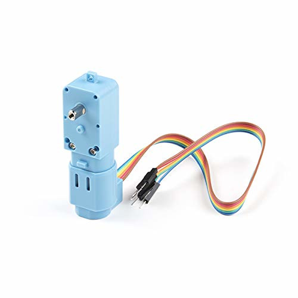
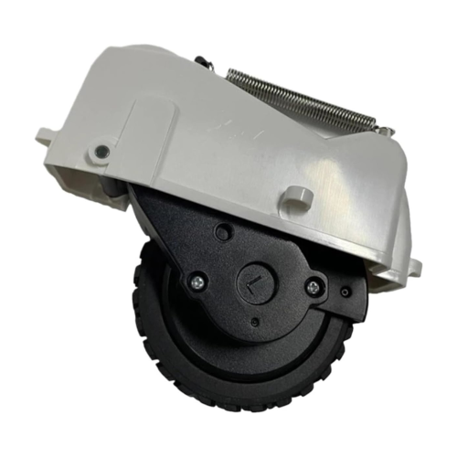

**Introduction**

ROSRider is a versatile electronics card that empowers you to create custom ROS-compatible robots. ROSRider can control and power a range of small encoder gear motors, enabling the construction of 2-wheeled or 4-wheeled robots of small to medium size. By cascading multiple ROSRider cards, you can expand the robot's capabilities to support higher wheel counts and more complex configurations.

Below is an image of a minimal chassis designed for lane-following tasks using image processing. This compact setup incorporates two encoder gear motors, a Raspberry Pi 4 computer, and a ROSRider card, all seamlessly integrated into a minimal footprint. This streamlined platform empowers developers to quickly prototype and experiment with autonomous vehicle concepts, making it an ideal tool for learning and innovation in robotics.

This image showcases a more advanced robotic platform designed for research and development. The integration of a ROSRider card and a ROS2RPI card with a Raspberry Pi enables the robot to execute a wide range of ROS programs and packages. The addition of a LiDAR sensor further empowers the robot with advanced capabilities such as SLAM, mapping, autonomous navigation, and autonomous exploration. This versatile platform provides a solid foundation for exploring various robotics applications and research projects.

The ROSRider and ROS2RPI cards significantly simplify the user experience by automating tasks like battery management and device power cycling. This eliminates the need for manual intervention, such as disconnecting batteries or manually powering on devices. Additionally, the cards can automatically put the system into a low-power hibernation mode when idle, conserving battery life.

The ROS2RPI card offers flexible serial port routing, enabling remote access to the Raspberry Pi and other devices like LiDAR sensors. This feature prevents boot conflicts caused by LiDAR serial output during system startup and allows for remote control of the LiDAR, extending its operational life and simplifying maintenance procedures.

**Supported Motors**

The ROSRider supports a wide range of encoder gear motors, which can be configured as servos through YAML files. Its dual-channel drivers, capable of delivering 1A continuous and 2.8A peak current, provide ample power for various robotic applications.

**Supported Platforms**

ROSRider is primarily designed for Raspberry Pi and Jetson platforms, leveraging their powerful processing capabilities and compact form factors. However, the card is compatible with any Linux-based system equipped with an I2C port.

**Future-Proof Design**

To ensure long-term usability and adaptability, the ROSRider card supports firmware updates via USB. This allows for continuous improvement and the addition of new features, without requiring specialized programming tools or hardware modifications.

**Advanced**

The system's built-in current monitoring, along with a hardware-resettable fuse, allows for software-based current limiting and physical protection of the motors and main battery. Remote monitoring and configuration of these thresholds via YAML files further enhance the system's flexibility and safety.

wake up

Publishes diagnostic packages, that contain battery voltage, consumed current, motor left current feedback, motor right current feedback, and status messages generated by board

__Next Chapter:__ [Connections and Pinmaps](../02_PINMAP/README.md)