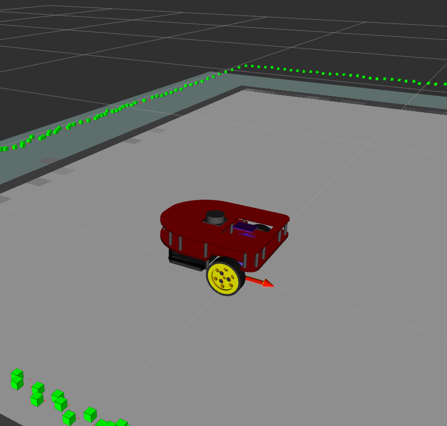
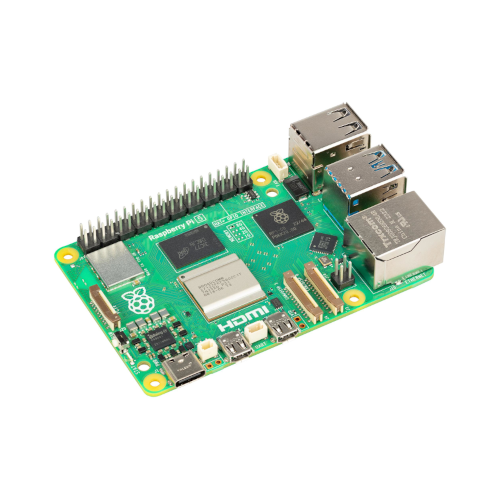
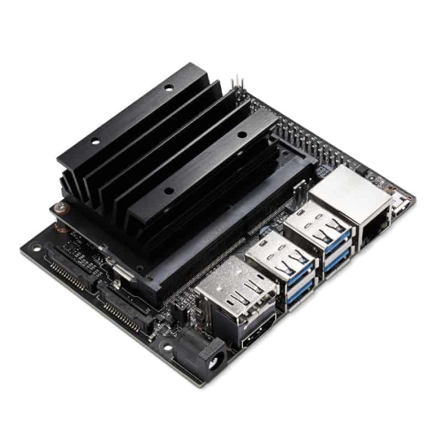
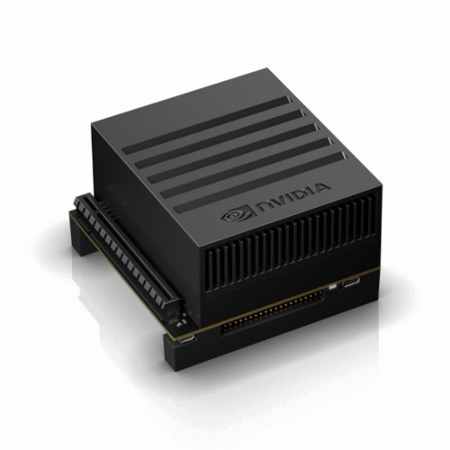

__Introduction__

To further enhance the integration of ROSRider with open-source robotics, we have developed two open-source robot platforms: Sorcerer and Caretta. These low-cost, pre-built robots, accompanied by URDF files for ROS and Gazebo simulation, streamline the development process. Developers can rapidly prototype and test algorithms in simulation before deploying them to physical hardware, significantly accelerating development time and reducing costs associated with physical experimentation.

  
  
  

__Supported Motors__

ROSRider can drive a wide range of encoder gear motors, from simple DC motors to high-precision gear motors commonly found in robotic vacuum cleaners. It supports both single-phase and dual-phase encoders, with parameters such as encoder PPR and gear reduction ratio configurable through YAML files. The dual-channel drivers, delivering 1A continuous and 2.8A peak current, provide ample power for various robotic applications. Additionally, users can fine-tune motor performance by adjusting parameters like forward and backward deadzones, PWM frequency (up to 18kHz for reduced noise), and motor driver configurations (brake mode, low-side and high-side decay).

  
  
  

__Future-Proof Design__

To ensure long-term usability and adaptability, the ROSRider card supports firmware updates via USB. This allows for continuous improvement and the addition of new features, without requiring specialized programming tools or hardware modifications.

To further expand its compatibility, we are exploring the possibility of a USB firmware version based on user demand.

It includes an SPI port for potential integration of additional sensors and actuators as technology advances and user needs evolve.

__Servo Control__

ROSRider can control two standard servos, enabling their integration into ROS-based robotic systems for applications like robotic arms, grippers, or camera gimbals.

__Software-Switchable Auxiliary Power Supply__ 

A 5V power supply can be enabled or disabled via software, providing flexibility for powering external sensors and devices.

__Modular Design__ 

ROSRider utilizes standard JST connectors for motor and I2C connections, allowing for easy assembly and customization. Additionally, two QWIC connectors provide convenient expansion options for integrating various sensors and modules.

__Robust Protection__ 

Built-in current monitoring and a hardware-resettable fuse safeguard the motors and battery. Software-based current limiting and remote threshold configuration enhance safety and flexibility.

__Timekeeping__ 

The integrated Real-Time Clock (RTC) enables precise timekeeping and scheduled wake-up events, facilitating autonomous operation and data logging.

__Enhanced Diagnostics__ 

The system publishes detailed diagnostic information, including battery voltage, current consumption, and motor current feedback, to aid in remote debugging and system monitoring.

__Remote PID Tuning__

ROSRider supports remote PID tuning, allowing users to adjust control parameters dynamically without manual intervention. By leveraging ROS parameter server, users can fine-tune the PID gains to optimize robot performance, such as motor control and sensor feedback.

__Customizable Input__

The button input pins on ROSRider are customizable, allowing users to connect external buttons for reset, wake-up, and user-defined functions.

__Supported Platforms__

ROSRider is primarily designed for Raspberry Pi and Jetson platforms, leveraging their powerful processing capabilities and compact form factors. However, the card is compatible with any Linux-based system equipped with an I2C port.

  
  
  

__Hardware Specifications__

__Features__

|---|---|
| MCU | 32-bit ARM Cortex: TM4C123GH6PM |
| Motor Drivers | Two channel up to 2.5 amps, with current measurement |
| Hardware QEI | Can use any encoder gear motor, single or double phase |
| Servo Control | Two channel standard servos |
| Connections | Uses standard JST connectors, and commodity JST cables |
| RTC | On board RTC, wake on alarm possible |
| Firmware Update | Device firmware is updatable by end user over USB |

__Power__

|---|---|
| Power Input | 6V to 15V wide input voltage |
| Software Controllable Switch | MOSFET switch, reverse current protection |
| Hibernation | Auto sleep, Device hibernates if not used certain time |
| Current Protection | PTC Resetable Fuse, and also software current protection |
| Power Input Connector | XT30 or Klemens Type Connector |
| Power Output | Software Controllable Auxillary Power Output 5V, 400mA |
| Monitoring | Measures and reports bus voltage, bus current, independent motor currents |

__Communications__

|---|---|
| I2C | Dual QWIC ports, also available on header. Can be used for cascading with multiple units |
| SPI | Serial peripheral interface connector |
| USB | CDC-USB Serial, 921600 Bauds |
| Serial | Standard Serial Port, available as JST connector or header |

__Software__

|---|---|
| ROS2 Drivers | C++ Drivers for ROS2 Humble and ROS2 Jazzy |
| Parametric | ROSRider is configurable using yaml files |
| Innovation | Autosyncs with host to generate low latency data |

With a solid understanding of the hardware layout, users can unleash the full potential of ROSRider. The subsequent chapter explores the pinmap system, showcasing the flexibility and customization options available.

__Next Chapter:__ [Connections and Pinmaps](../02_PINMAP/README.md)