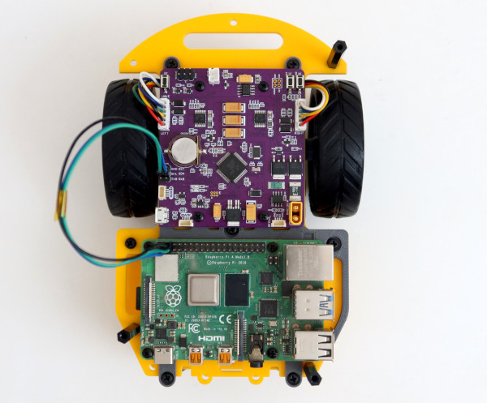

**Introduction**

ROSRider is a versatile electronics card that empowers you to create custom ROS-compatible robots. ROSRider can control and power a range of small encoder gear motors, enabling the construction of 2-wheeled or 4-wheeled robots of small to medium size.

*Fig1: I2C connection with Raspberry PI*

**Supported Motors**

- Any encoder gear motor can be used as a servo motor. Parameters such as reduction ratio, wheel diameter, encoder ppr are configurable with yaml files

[photos of motors]

**Supported Platforms**

**Advanced**

- Publishes diagnostic packages, that contain battery voltage, consumed current, motor left current feedback, motor right current feedback, and status messages generated by board
- Under-voltage, Over-voltage, Over-current, Motor over-current limits can be configured

__Next Chapter:__ [Connections and Pinmaps](../02_PINMAP/README.md)