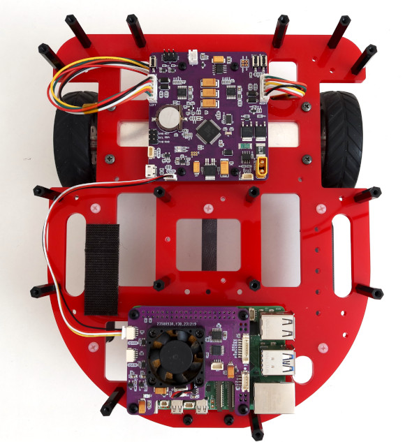
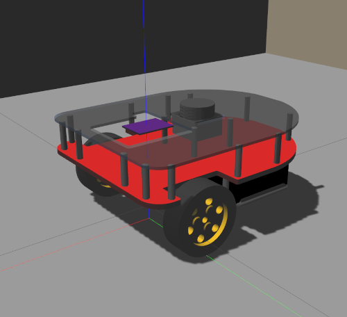

**Introduction**

ROSRider is a versatile electronics card that empowers you to create custom ROS-compatible robots. ROSRider can control and power a range of small encoder gear motors, enabling the construction of 2-wheeled or 4-wheeled robots of small to medium size. By cascading multiple ROSRider cards, you can expand the robot's capabilities to support higher wheel counts and more complex configurations.

ROSRider is designed to empower makers and students, especially in developing countries, to build robots using readily available components. Unlike pre-built kits that can be costly and limiting, ROSRider is a versatile platform that can be integrated with existing hardware, such as motors, sensors, and controllers. This approach encourages creativity, reduces costs, and promotes the reuse of existing components, making robotics accessible to a wider audience.

Below is an image of a minimal chassis designed for lane-following tasks using image processing. This compact setup incorporates two encoder gear motors, a Raspberry Pi 4 computer, and a ROSRider card, all seamlessly integrated into a minimal footprint. This streamlined platform empowers developers to quickly prototype and experiment with autonomous vehicle concepts, making it an ideal tool for learning and innovation in robotics.

This image showcases a more advanced robotic platform designed for research and development. The integration of a ROSRider card and a ROS2RPI card with a Raspberry Pi enables the robot to execute a wide range of ROS programs and packages. The addition of a LiDAR sensor further empowers the robot with advanced capabilities such as SLAM, mapping, autonomous navigation, and autonomous exploration. This versatile platform provides a solid foundation for exploring various robotics applications and research projects.

The ROSRider and ROS2RPI cards significantly simplify the user experience by automating tasks like battery management and device power cycling. This eliminates the need for manual intervention, such as disconnecting batteries or manually powering on devices. Additionally, the cards can automatically put the system into a low-power hibernation mode when idle, conserving battery life.

The ROS2RPI card offers flexible serial port routing, enabling remote access to the Raspberry Pi and other devices like LiDAR sensors. This feature prevents boot conflicts caused by LiDAR serial output during system startup and allows for remote control of the LiDAR, extending its operational life and simplifying maintenance procedures.

To further enhance the integration of ROSRider with open-source robotics, we have developed two open-source robot platforms: Sorcerer and Caretta. These low-cost, pre-built robots, accompanied by URDF files for ROS and Gazebo simulation, streamline the development process. Developers can rapidly prototype and test algorithms in simulation before deploying them to physical hardware, significantly accelerating development time and reducing costs associated with physical experimentation.

  
  
  

**Supported Motors**

ROSRider can drive a wide range of encoder gear motors, from simple DC motors to high-precision gear motors commonly found in robotic vacuum cleaners. It supports both single-phase and dual-phase encoders, with parameters such as encoder PPR and gear reduction ratio configurable through YAML files. The dual-channel drivers, delivering 1A continuous and 2.8A peak current, provide ample power for various robotic applications. Additionally, users can fine-tune motor performance by adjusting parameters like forward and backward deadzones, PWM frequency (up to 18kHz for reduced noise), and motor driver configurations (brake mode, low-side and high-side decay).

  
  
  

**Future-Proof Design**

To ensure long-term usability and adaptability, the ROSRider card supports firmware updates via USB. This allows for continuous improvement and the addition of new features, without requiring specialized programming tools or hardware modifications.

To further expand its compatibility, we are exploring the possibility of a USB firmware version based on user demand.

**Servo Control**

ROSRider can control two standard servos, enabling their integration into ROS-based robotic systems for applications like robotic arms, grippers, or camera gimbals.

**Software-Switchable Auxiliary Power Supply** 

A 5V power supply can be enabled or disabled via software, providing flexibility for powering external sensors and devices.

**Modular Design** 

ROSRider utilizes standard JST connectors for motor and I2C connections, allowing for easy assembly and customization. Additionally, two QWIC connectors provide convenient expansion options for integrating various sensors and modules.

**Robust Protection** 

Built-in current monitoring and a hardware-resettable fuse safeguard the motors and battery. Software-based current limiting and remote threshold configuration enhance safety and flexibility.

**Timekeeping** 

The integrated Real-Time Clock (RTC) enables precise timekeeping and scheduled wake-up events, facilitating autonomous operation and data logging.

**Enhanced Diagnostics** 

The system publishes detailed diagnostic information, including battery voltage, current consumption, and motor current feedback, to aid in remote debugging and system monitoring.

**Customizable Input**

The button input pins on ROSRider are customizable, allowing users to connect external buttons for reset, wake-up, and user-defined functions.

**Supported Platforms**

ROSRider is primarily designed for Raspberry Pi and Jetson platforms, leveraging their powerful processing capabilities and compact form factors. However, the card is compatible with any Linux-based system equipped with an I2C port.

  
  
  

__Next Chapter:__ [Connections and Pinmaps](../02_PINMAP/README.md)