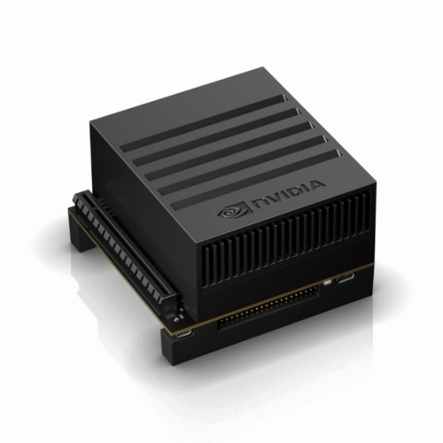

    

        > System Features
    

| :---| :---|
| ***MCU*** | 32-bit ARM Cortex: TM4C123GH6PM |
| ***Motor Drivers*** | Two channel up to 2.5 amps with current feedback |
| ***Hardware QEI*** | Can use any encoder gear motor, single or double phase |
| ***Servo Control*** | Two channel standard servos |
| ***Connections*** | Uses standard JST connectors and commodity JST cables |
| ***RTC*** | The integrated Real-Time Clock enables precise timekeeping |
| ***Firmware Update*** | Device firmware is updatable by end user over USB |
| ***Enhanced Diagnostics*** | The system publishes detailed diagnostic information including battery voltage, current consumption and motor current feedback |
| ***Synchronization***| Synchronizes with the host computer to ensure low-latency data transmission |

    

        > Advanced Features
    

| :---| :---|
| ***Cascaded Current Loop*** | A cascaded current loop enables precise torque control and superior dynamic response |
| ***Synchronized ADC*** | ADC samples current synchronized with the PWM generator and selectively integrates waveform |
| ***Current Measurement*** | Motor currents are measured and filtered |
| ***Velocity Measurement*** | Velocity is measured via hardware QEI (Quadrature Encoder Interface) and filtered |
| ***Kinematic Feedforwards*** | Acceleration and Velocity Feedforwards |
| ***Stribeck Friction Model*** | Static Kick, Coulomb Run, Viscous Friction |
| ***BEMF Compensation*** | Back-EMF compensated from current measurements |
| ***Selectable Filters*** | The firmware also implements custom selectable filters for both current (I) and rotational speed (ω) filtering |

The inclusion of a cascaded current loop significantly enhances the control architecture by 
placing a high-bandwidth current controller inside the velocity loop; this allows for precise torque control, 
faster response to disturbances, and a more stable overall system compared to simple single-loop designs.

    

        > Power
    

| :---| :---|
| ***Power Input*** | 6V to 15V wide input voltage |
| ***Software Controllable Switch*** | MOSFET switch, reverse current protection |
| ***Hibernation*** | Auto sleep, Device hibernates if not used certain time |
| ***Current Protection*** | PTC Resettable Fuse, and also software current protection |
| ***Power Input Connector*** | XT30 or Klemens Type Connector |
| ***Power Output*** | Software Controllable Auxiliary Power Output 5V, 400mA |
| ***Power Monitoring*** | Measures and reports bus voltage, bus current, independent motor currents |

Built-in current monitoring and a hardware-resettable fuse safeguard the motors and battery. Software-based current limiting and remote threshold configuration enhance safety and flexibility.
A 5V power supply can be enabled or disabled via software, providing flexibility for powering external sensors and devices.
ROSRider utilizes standard JST connectors for motor and I2C connections, allowing for easy assembly and customization. Additionally, two QWIC connectors provide convenient expansion options for integrating various sensors and modules.

    

        > Communications
    

| :---| :---|
| ***I2C*** | Dual QWIC ports, also available on header |
| ***USB*** | CDC-USB Serial, 921600 Bauds |
| ***Serial*** | Standard Serial Port, available as JST connector or header |

The device currently uses I2C for communication, but it can also operate over USB, which is primarily used for firmware updates.

    

        > Software
    

| :---| :---|
| ***ROS Drivers*** | C++ Drivers for ROS2 Humble and ROS2 Jazzy |
| ***Gazebo Environment*** | Gazebo implementation and environments for our robots |
| ***PID Tuning*** | Custom software for PID Tuning |
| ***Parameter Manager*** | Custom software to quickly and remotely set parameters. Useful for tuning |
| ***Calibration Software*** | Scripts to determine torque constant of motors |

This project is primarily a software-driven effort, and we continually develop and update our software as part of an ongoing, continuous development cycle.

    

        > Supported Platforms
    

ROSRider is primarily designed for Raspberry Pi and Jetson platforms, leveraging their powerful processing capabilities and compact form factors. However, the card is compatible with any Linux-based system equipped with an I2C port.

  
  <figure style="width: 25%; margin: 0; text-align: center;">
    
    <figcaption>Fig 1. Raspberry Pi 5</figcaption>
  </figure>

  <figure style="width: 25%; margin: 0; text-align: center;">
    
    <figcaption>Fig 2. Jetson Nano</figcaption>
  </figure>

  <figure style="width: 25%; margin: 0; text-align: center;">
    
    <figcaption>Fig 3. Jetson AGX</figcaption>
  </figure>

__Next Chapter:__ [Connections and Pinmaps](../02_PINMAP/README.md)