## Board Port Diagram

ROSRider card is equipped with number of ports and connectors, for connecting to encoder motors, and other peripherals.  
Pinmaps of each connector and port will be illustrated in detail.  

Below is a diagram of ports of ROSRider control card:  
  

## Left Motor Connector

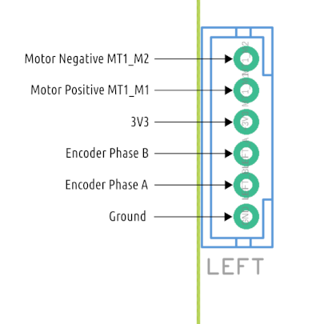

| -------- | ------- |
| Pin No   | Description |
| 1        | Motor Negative MT1_M2 |
| 2        | Motor Positive MT1_M1 |
| 3        | 3V3 |
| 4        | Encoder Phase B |
| 5        | Encoder Phase A |
| 6        | Ground |	

## Right Motor Connector

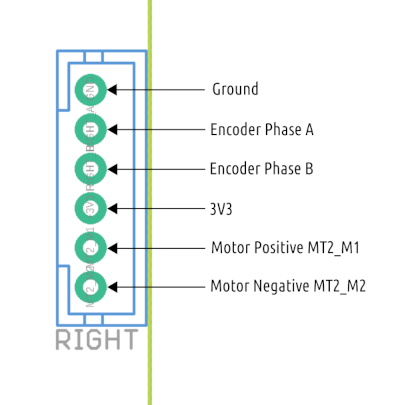

| -------- | ------- |
| Pin No   | Description |
| 6        | Ground |
| 5        | Encoder Phase B |
| 4        | Encoder Phase B |
| 3        | 3V3 |
| 2        | Motor Positive MT2_M1 |
| 1        | Motor Negative MT2_M2 |

## Servo Connector

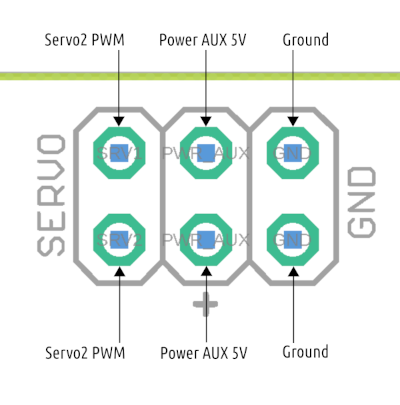

## AUX Power Port

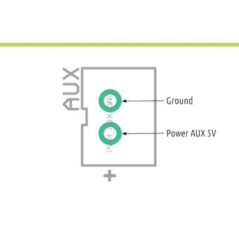

## Power Control Port

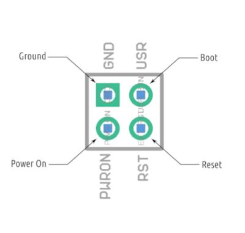

## Communications Port

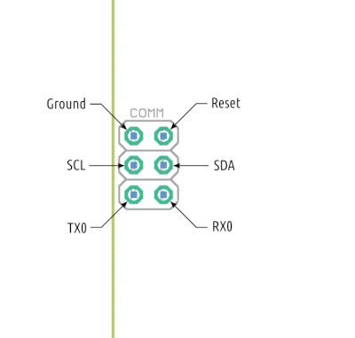

## QWIC A Port

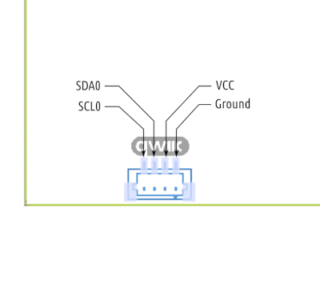

## QWIC B Port

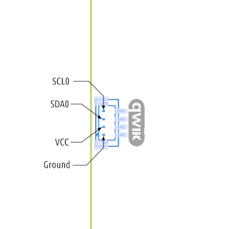

## SPI Port

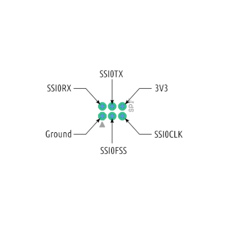

## Serial Port

## Power Connector

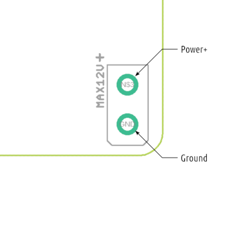

## Battery

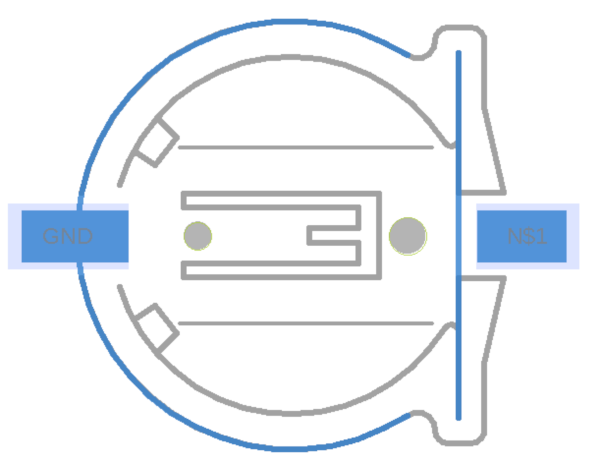

__Next Chapter:__ [Connecting ROSRider to Host Computer](../03_CONNECT/README.md)