

  > Pinmaps and Connections

  "Covers comprehensive signal pinouts and hardware specifications, including the physical wiring required to establish communication with the host system."



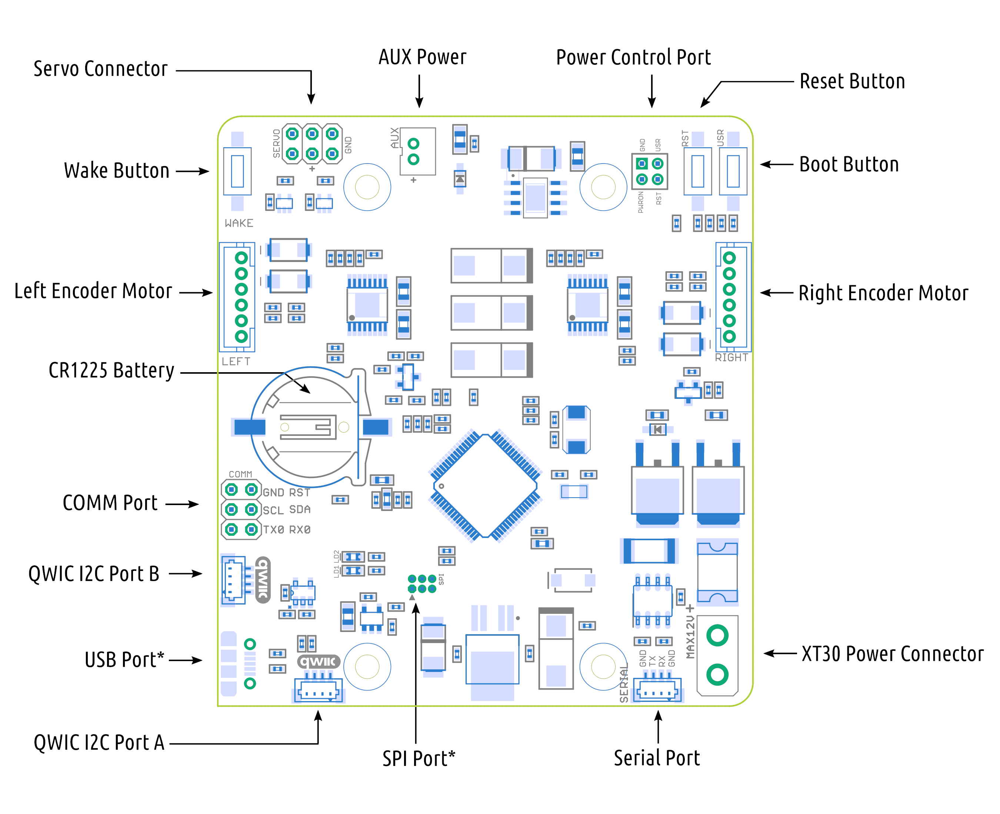





__Left Motor Connector__

This standard 6-wire encoder motor connector is compatible with various motors and can be used with standard cables.

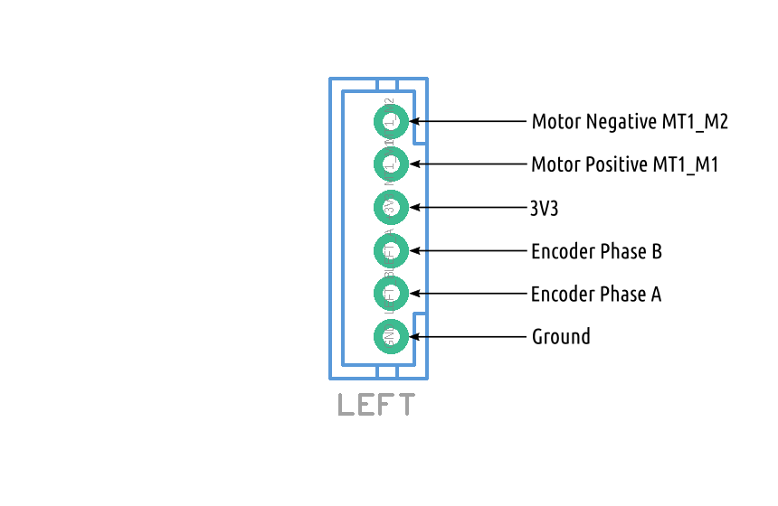





__Right Motor Connector__

The right motor connector is a mirrored version of the left motor connector.

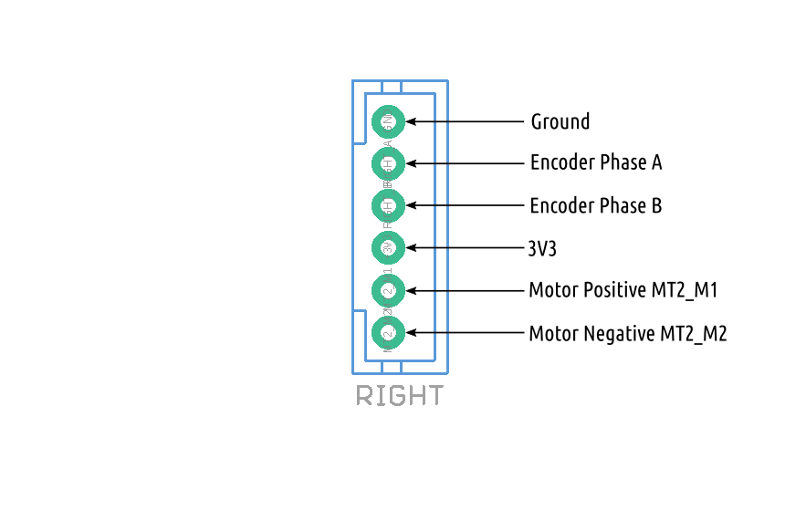





__Servo Connector__

The ROSRider card can control two standard servos. The servos are powered by auxiliary power, which must be enabled via software before use.

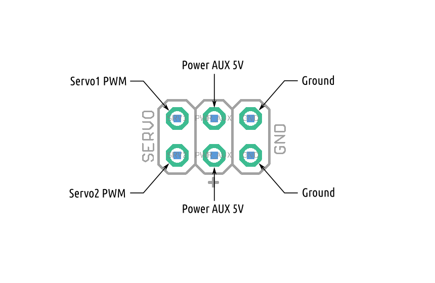





__AUX Power Port__

Software controllable auxillary power port, will generate 5V when turned on.

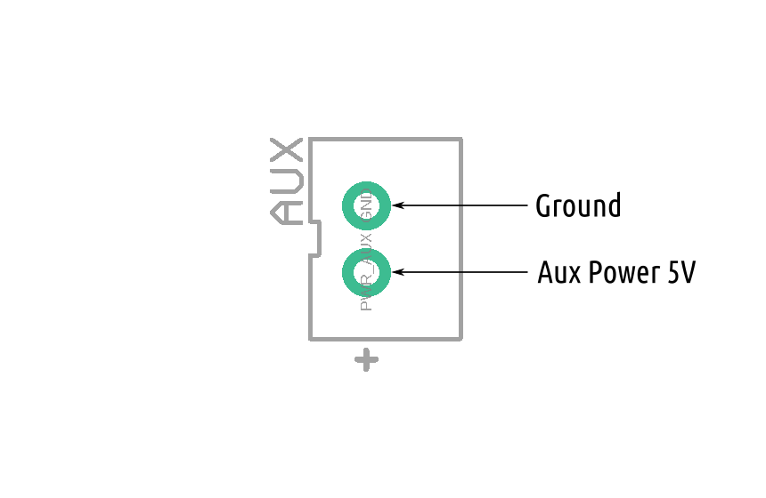





__Power Control Port__

This is an internal connector, that can be used to control buttons on the board remotely. The connector is not soldered, and left for future expansion.

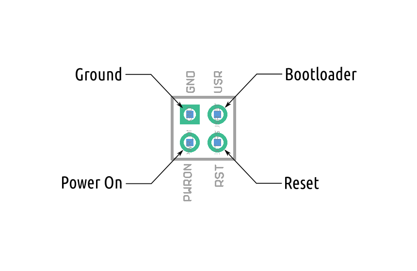





__Communications Port__

This pin header can be used for both I2C0 and serial port communication. The reset pin is decoupled with a 150nF capacitor to isolate it from the internal reset.

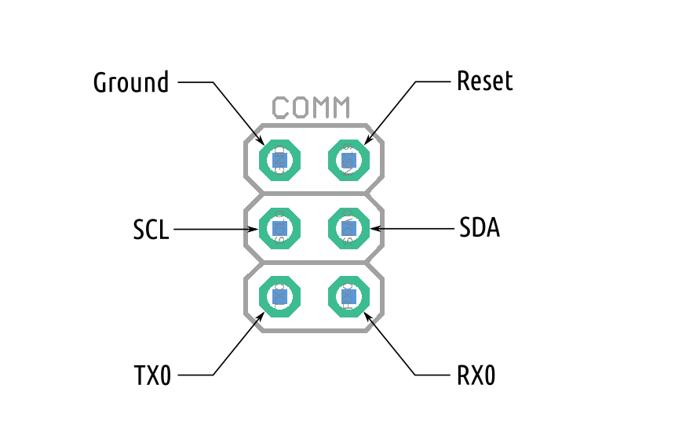





__I2C QWIC Port A__

This is a standard QWIC port, which can be connected by a standard QWIC cable. The VCC from QWIC cable is used to wake up the board from hibernate state and is isolated from device.

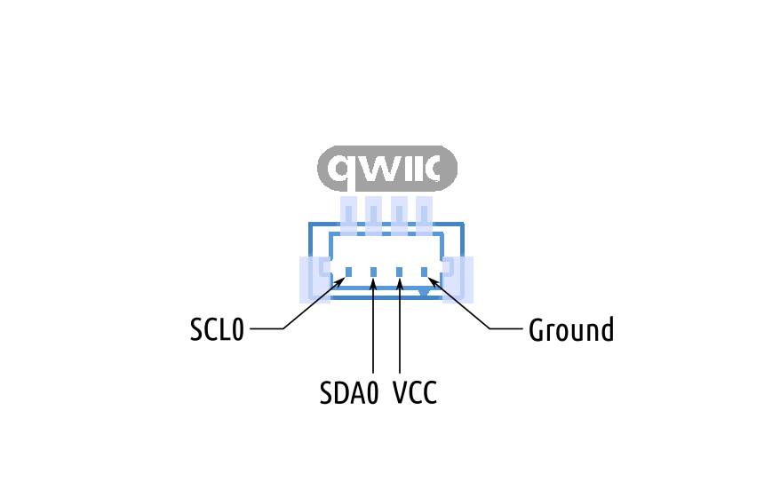





__I2C QWIC Port B__

There are two identical QWIC ports, that can be used to connect other QWIC devices, or piggyback another ROSRider card.

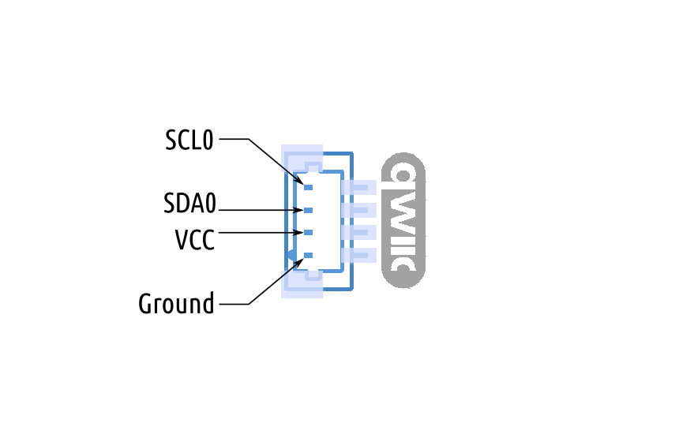





__Serial Port__

Serial Port debug connector, this can be connected to ROS2RPI card for accessing serial port. **DO NOT** connect to a QWIC port, as this may short the power supply.

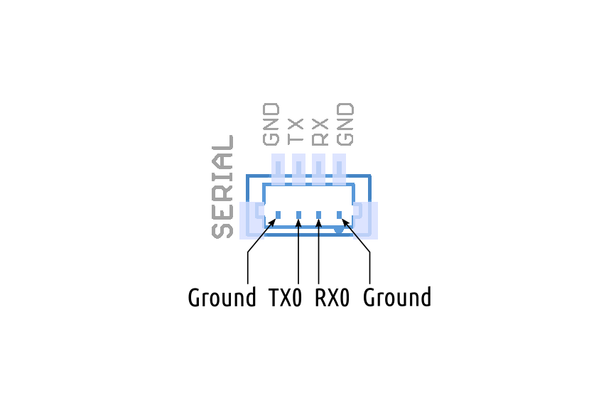





__Power Connector__

XT30 Power Connector. Apply maximum 12V.

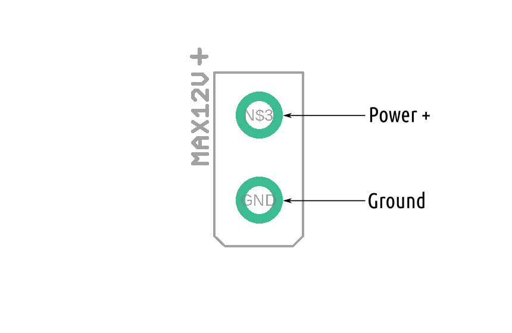





__Battery__

Use CR1225 3V coin battery.

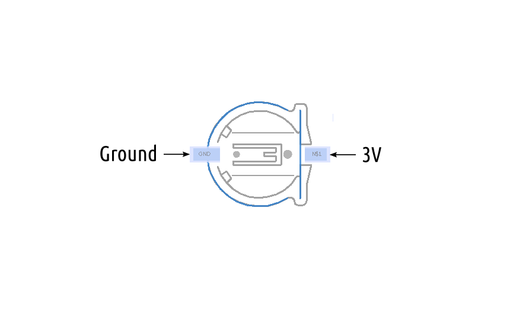



{% include tabs.html 
   tab1_title="Diagram" 
   tab1_content=tab1
   tab2_title="Left" 
   tab2_content=tab2
   tab3_title="Right" 
   tab3_content=tab3
   tab4_title="Servo" 
   tab4_content=tab4
   tab5_title="AUX" 
   tab5_content=tab5
   tab6_title="Power Control" 
   tab6_content=tab6
   tab7_title="Comms" 
   tab7_content=tab7
   tab8_title="I2C A" 
   tab8_content=tab8
   tab9_title="I2C B" 
   tab9_content=tab9
   tab10_title="Serial" 
   tab10_content=tab10
   tab11_title="Power" 
   tab11_content=tab11
   tab12_title="Battery" 
   tab12_content=tab12
%}

    

        > Connecting to Host Computer
    

__Connecting ROSRider to Raspberry PI__

This wiring diagram illustrates direct I2C communication with the Raspberry PI.
To enable I2C communication on a Raspberry Pi running Ubuntu, first ensure I2C is enabled by adding
`dtparam=i2c_arm=on` to `/boot/firmware/config.txt` and rebooting.  

Use jumper wires to connect your Raspberry PI using GPIO pins 2 (SDA) and 3 (SCL).
After installation, verify the connection using `sudo i2cdetect -y 1` to detect connected devices.  

  <figure style="width: 60%; margin: 0; text-align: center;">
    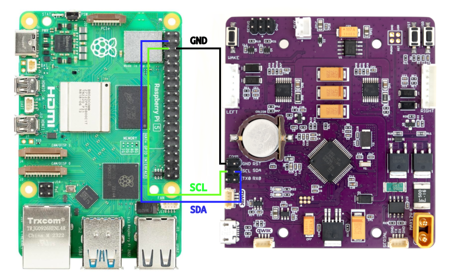
    <figcaption>Raspberry PI Wiring Diagram.</figcaption>
  </figure>

__Detecting I2C Devices__

For troubleshooting purposes, you may want to detect I2C devices connected to your computer.
To do this, you can use the `i2cdetect` command in the terminal. Run the following command to install i2c-tools: `sudo apt install i2c-tools`.
Use the `i2cdetect` command to scan the I2C bus and identify connected devices:  

  

    <pre id="command-i2cdetect">sudo i2cdetect -y -r 1</pre>
  

  <clipboard-copy style="position:absolute; right:8px; top:8px;" for="command-i2cdetect">
    <svg aria-hidden="true" height="16" viewBox="0 0 16 16" version="1.1" width="16" data-view-component="true" class="octicon octicon-copy js-clipboard-copy-icon">
    <path d="M0 6.75C0 5.784.784 5 1.75 5h1.5a.75.75 0 0 1 0 1.5h-1.5a.25.25 0 0 0-.25.25v7.5c0 .138.112.25.25.25h7.5a.25.25 0 0 0 .25-.25v-1.5a.75.75 0 0 1 1.5 0v1.5A1.75 1.75 0 0 1 9.25 16h-7.5A1.75 1.75 0 0 1 0 14.25Z"></path><path d="M5 1.75C5 .784 5.784 0 6.75 0h7.5C15.216 0 16 .784 16 1.75v7.5A1.75 1.75 0 0 1 14.25 11h-7.5A1.75 1.75 0 0 1 5 9.25Zm1.75-.25a.25.25 0 0 0-.25.25v7.5c0 .138.112.25.25.25h7.5a.25.25 0 0 0 .25-.25v-7.5a.25.25 0 0 0-.25-.25Z"></path>
    </svg>
    <svg aria-hidden="true" height="16" viewBox="0 0 16 16" version="1.1" width="16" data-view-component="true" class="octicon octicon-check js-clipboard-check-icon color-fg-success d-none">
    <path d="M13.78 4.22a.75.75 0 0 1 0 1.06l-7.25 7.25a.75.75 0 0 1-1.06 0L2.22 9.28a.751.751 0 0 1 .018-1.042.751.751 0 0 1 1.042-.018L6 10.94l6.72-6.72a.75.75 0 0 1 1.06 0Z"></path>
    </svg>
  </clipboard-copy>

This command will display a table of I2C addresses. The default address of the ROSRider is `0x3C`, and the default address of the ROS2RPI card is `0x20`.
If you only have a ROSRider connected directly, you should only see the address `0x3C`.

__Connecting ROSRider to NVIDIA Jetson__

The NVIDIA Jetson has two I2C ports accessible via the header.
To ensure proper communication with I2C devices, it's crucial to configure the I2C voltage level.
This is accomplished using a jumper (J514) on the board. To select 3.3V I2C, position the jumper accordingly.
To ensure proper I2C communication, verify that I2C is enabled at the kernel level and that your user account has the necessary permissions to access the I2C bus on the host computer.

There are two I2C ports on the Jetson AGX:

  
  <figure style="width: 45%; margin: 0; text-align: center;">
    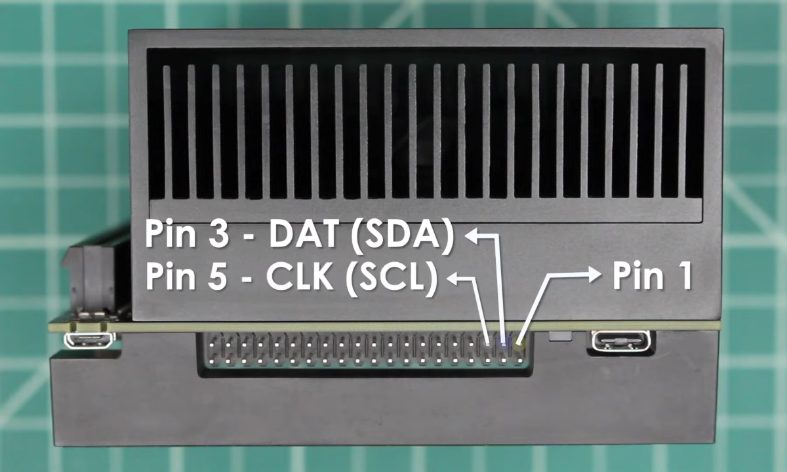
    <figcaption>Jetson AGX I2C Port 0</figcaption>
  </figure>

  <figure style="width: 45%; margin: 0; text-align: center;">
    
    <figcaption>Jetson AGX I2C Port 1</figcaption>
  </figure>

__Next Chapter:__ [ROS2 Drivers](../04_DRIVERS/README.md)