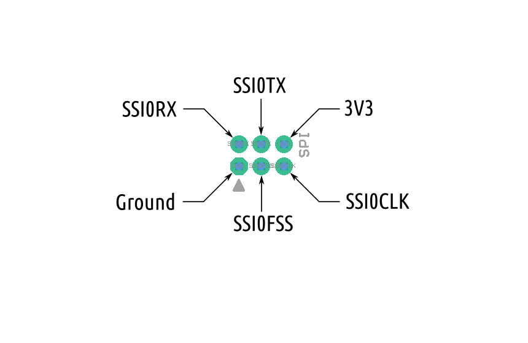

ROSRider card is equipped with number of ports and connectors, for connecting to encoder motors, and other peripherals.  
Pinmaps of each connector and port will be illustrated in detail.  

Below is a diagram of ports of ROSRider control card:  
  

## Left Motor Connector

This is a standard 6 wire encoder motor connector, that is compatible with many motors and can be connected with standard cables. ROSRider card can be used with dual phase or single phase encoders, and encoder type can be configured via software. If single phase encoder is used, use Encoder Phase A pin, and leave Encoder Phase B pin unconnected.

## Right Motor Connector

Right motor connector is mirrored version of Left motor connector.

## Servo Connector

ROSRider card can control two standard servos. Servos are powered via auxillary power, and before servos can be used, auxillary power must be switched on through software.

## AUX Power Port

Software controllable auxillary power port, will generate 5V when turned on.

## Power Control Port

This is an internal connector, that can be used to control buttons on the board remotely. The connector is not soldered, and left for future expansion.

## Communications Port

Both I2C0 and Serial Port can be accessed using this pin header. Reset pin is decoupled with a 150nF capacitor to internal reset.

## I2C QWIC Port A

This is a standard QWIC port, which can be connected by a standard QWIC cable. The VCC from QWIC cable is used to wake up the board from hibernate state and is isolated from device.

## I2C QWIC Port B

There are two identical QWIC ports, that can be used to connect other QWIC devices, or piggyback another ROSRider card.

## SPI Port

SPI port has been added for future expansion, and not supported by firmware at this point.

## Serial Port

Serial Port debug connector, this can be connected to ROS2RPI card for accessing serial port. **DO NOT** connect to a QWIC port, as this may short the power supply.

## Power Connector

XT30 Power Connector. Apply maximum 12V.

## Battery

Use CR1225 3V coin battery.

__Next Chapter:__ [Connecting ROSRider to Host Computer](../03_CONNECT/README.md)