## Board Port Diagram

ROSRider card is equipped with number of ports and connectors, for connecting to encoder motors, and other peripherals.  
Pinmaps of each connector and port will be illustrated in detail.  

Below is a diagram of ports of ROSRider control card:  
  

## Left Motor Connector

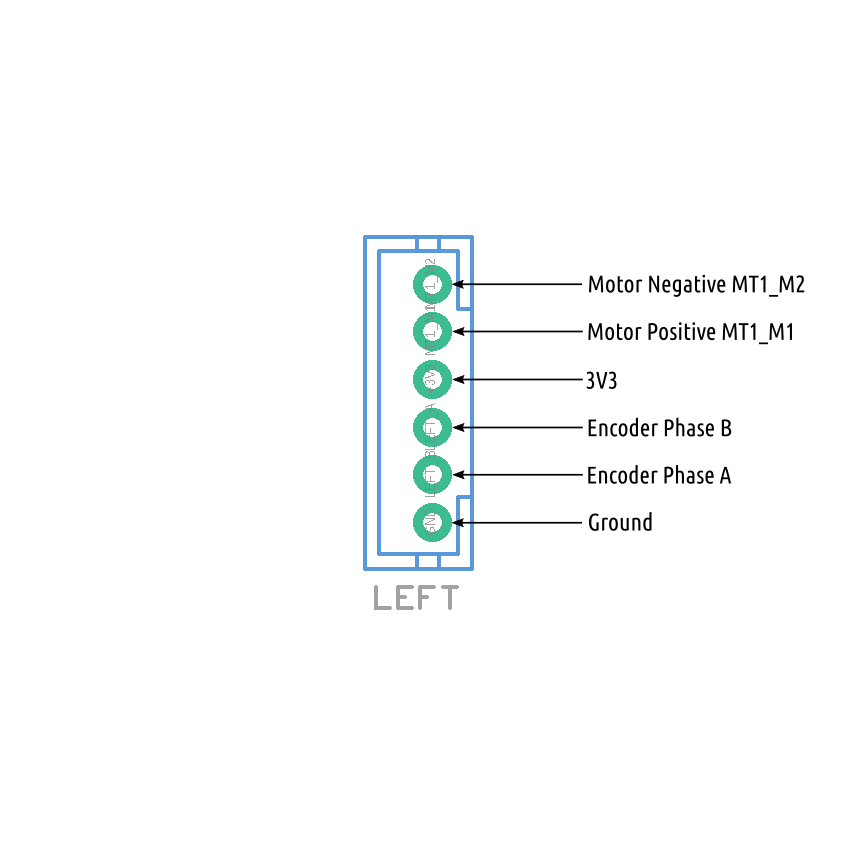

## Right Motor Connector

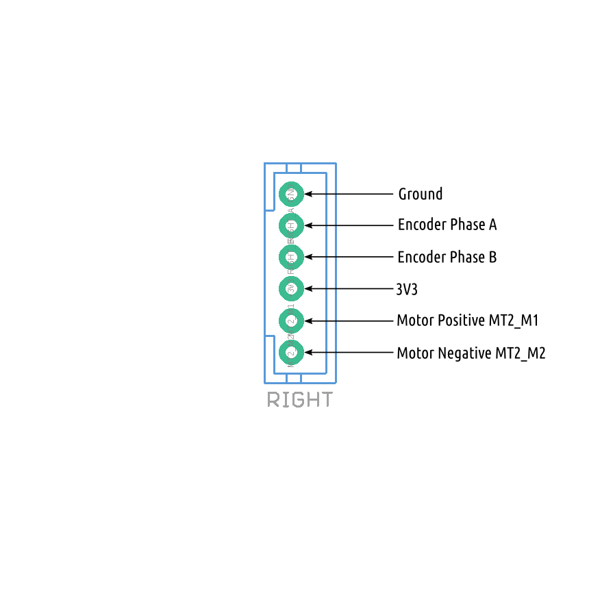

## Servo Connector

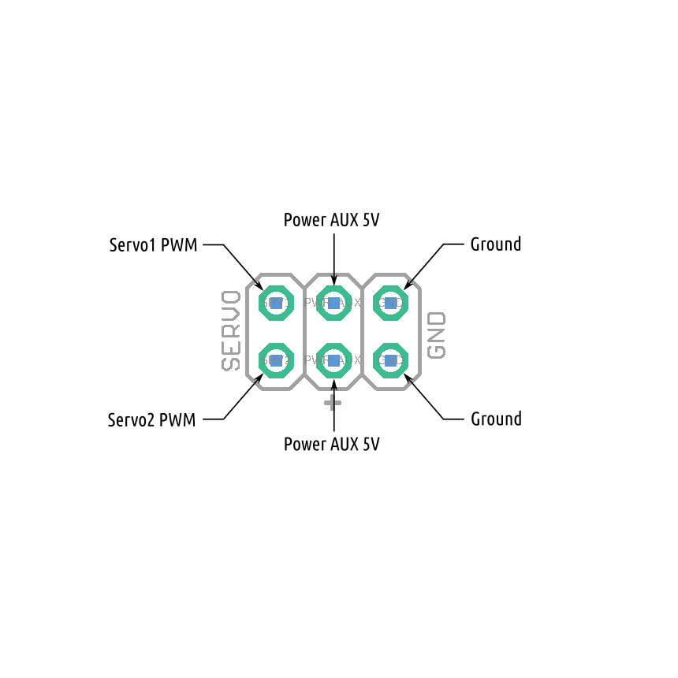

## AUX Power Port

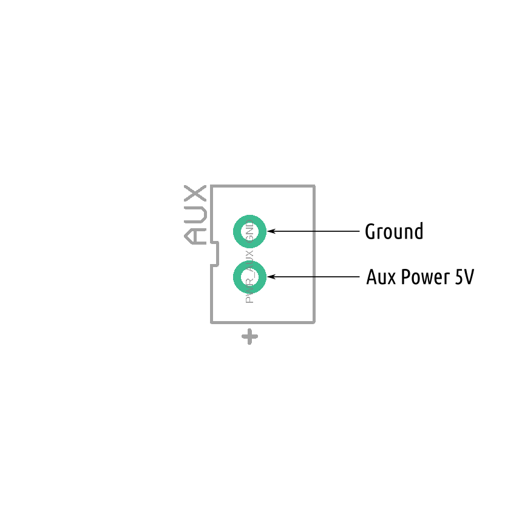

## Power Control Port

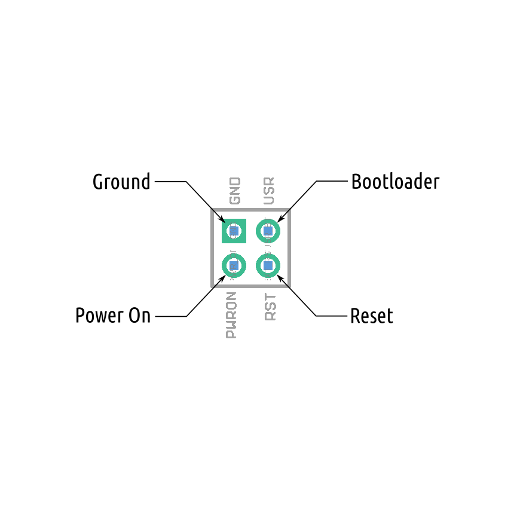

## Communications Port

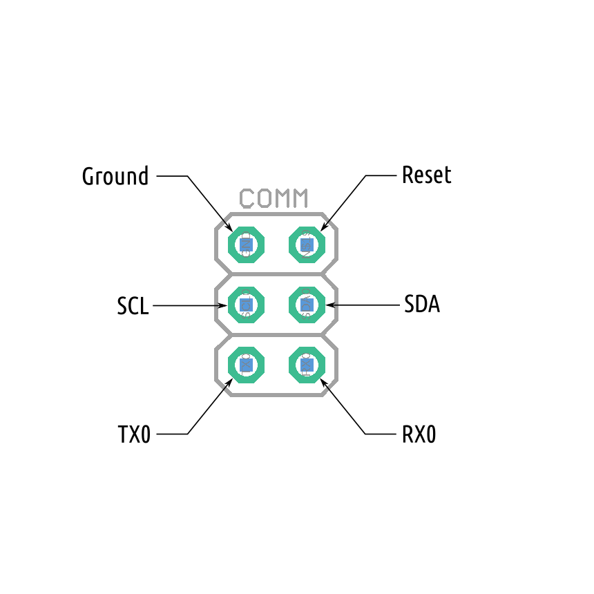

## I2C QWIC Port A

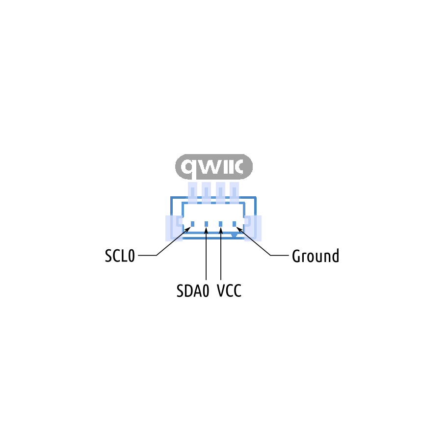

## I2C QWIC Port B

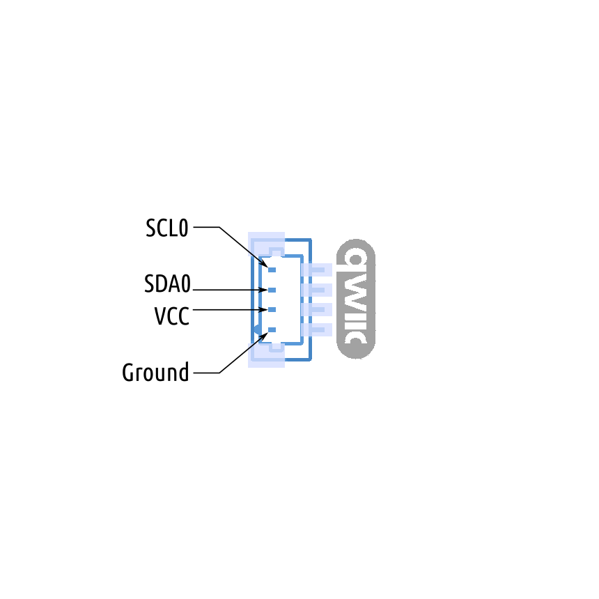

## SPI Port

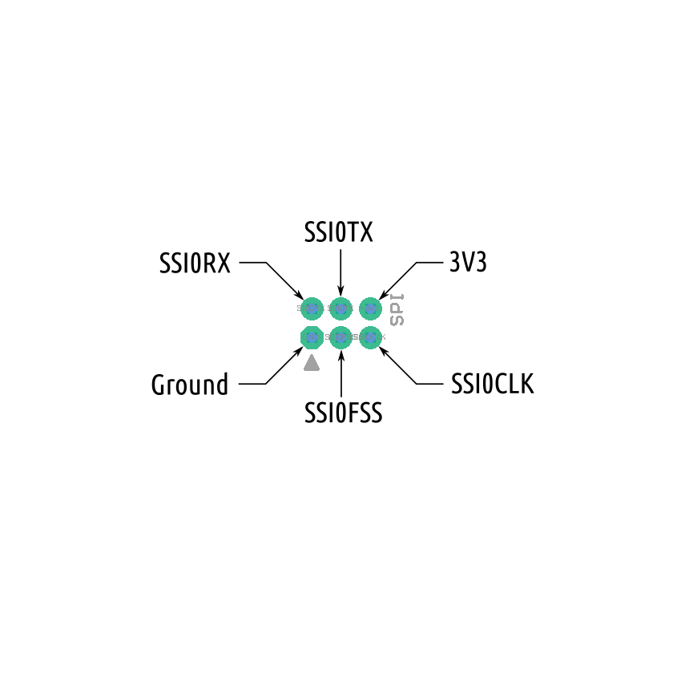

## Serial Port

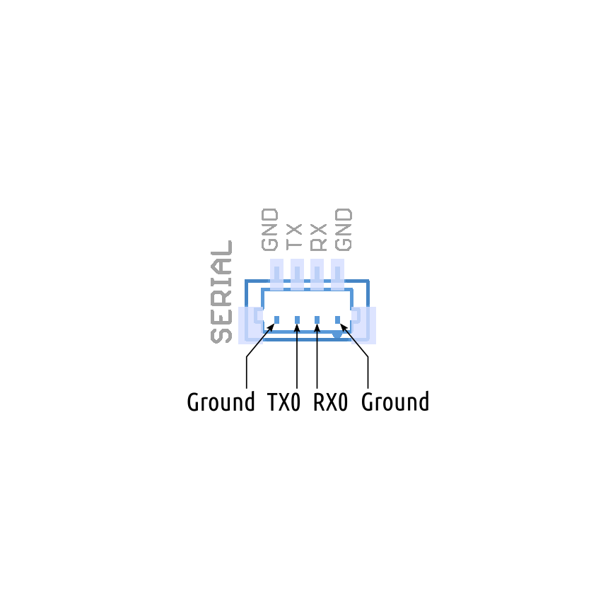

## Power Connector

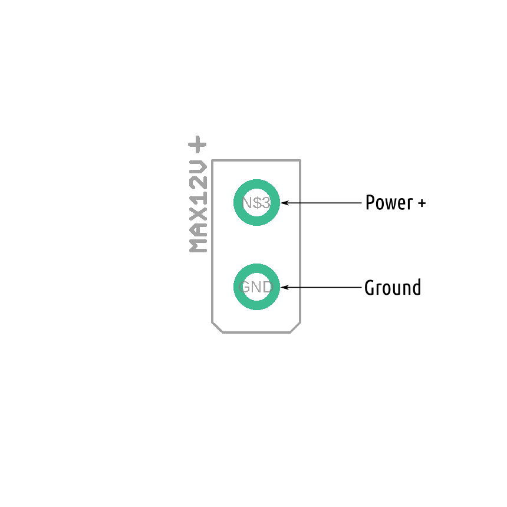

## Battery

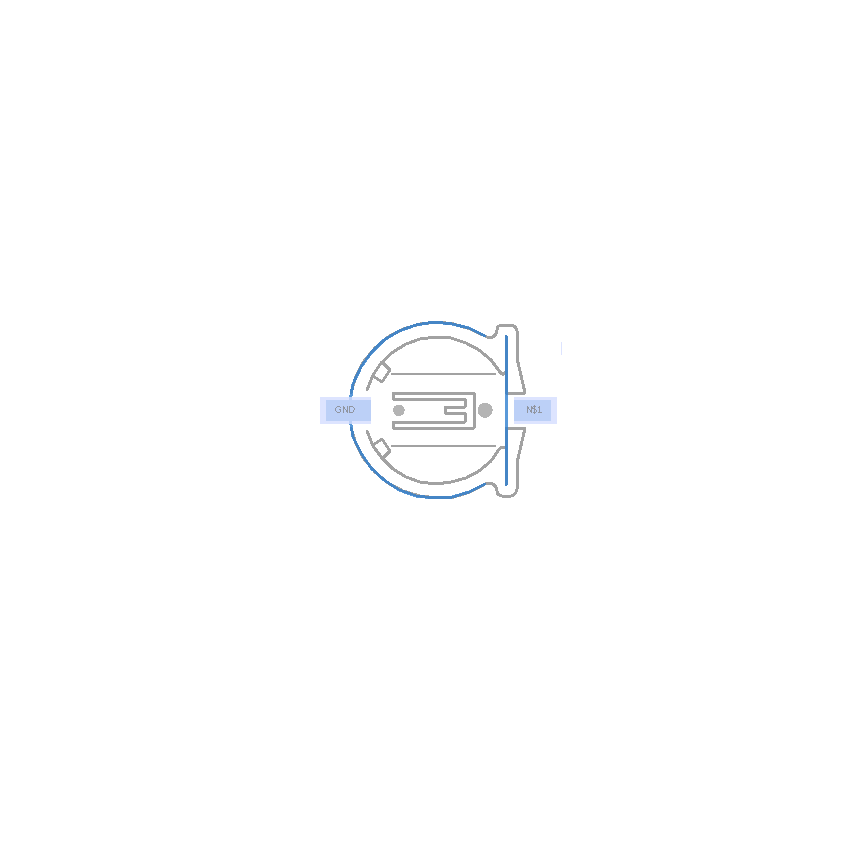

__Next Chapter:__ [Connecting ROSRider to Host Computer](../03_CONNECT/README.md)