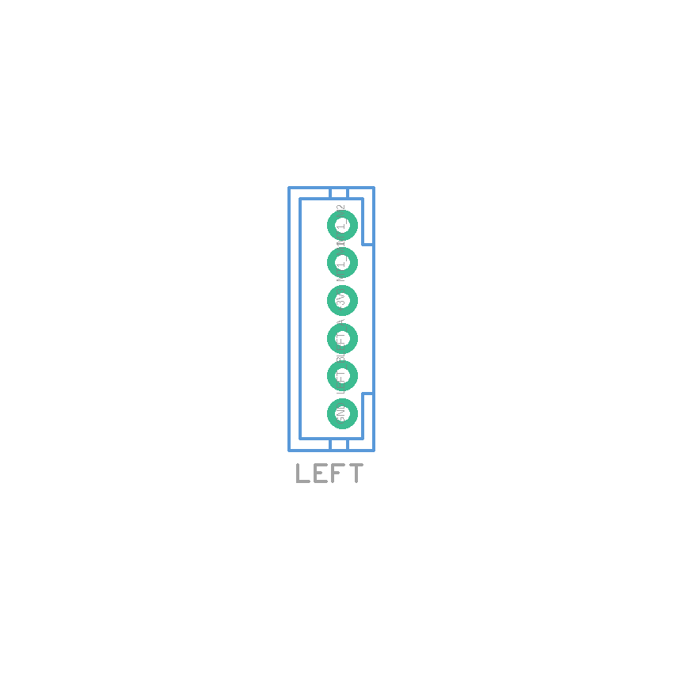
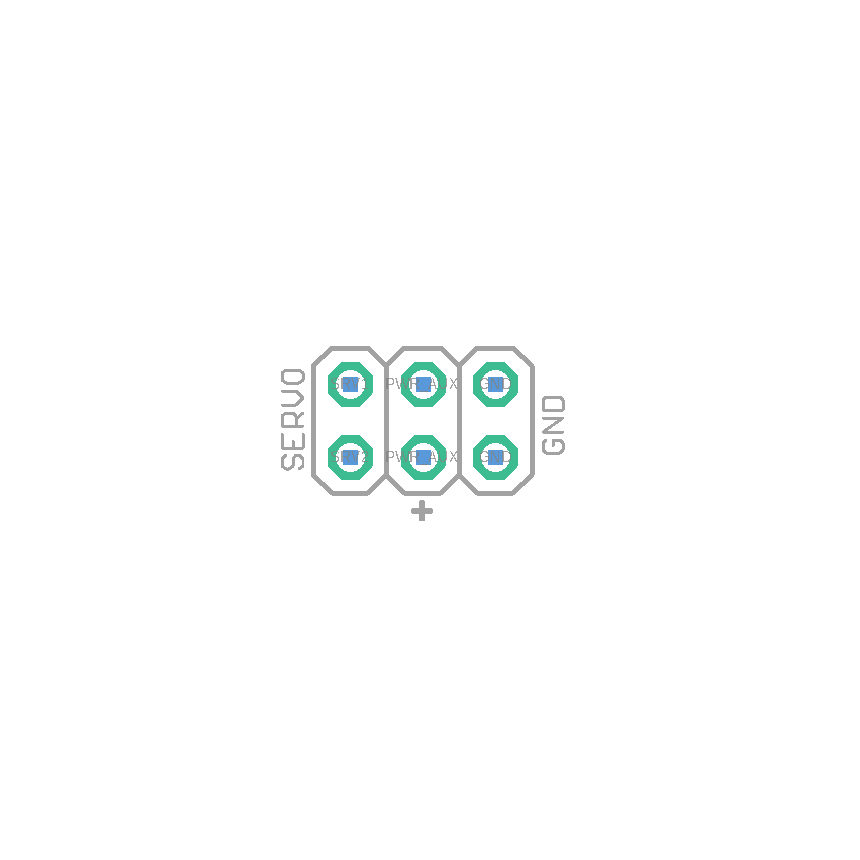
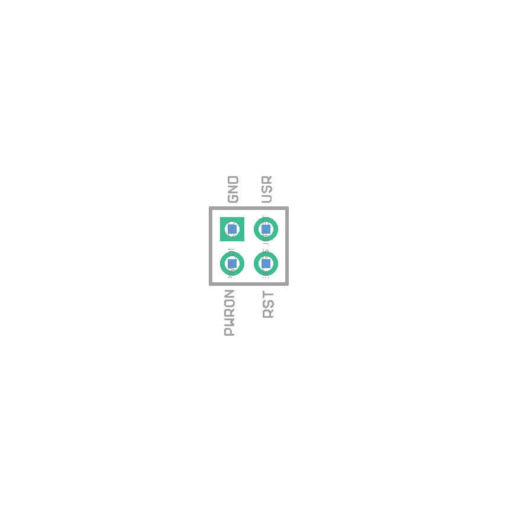
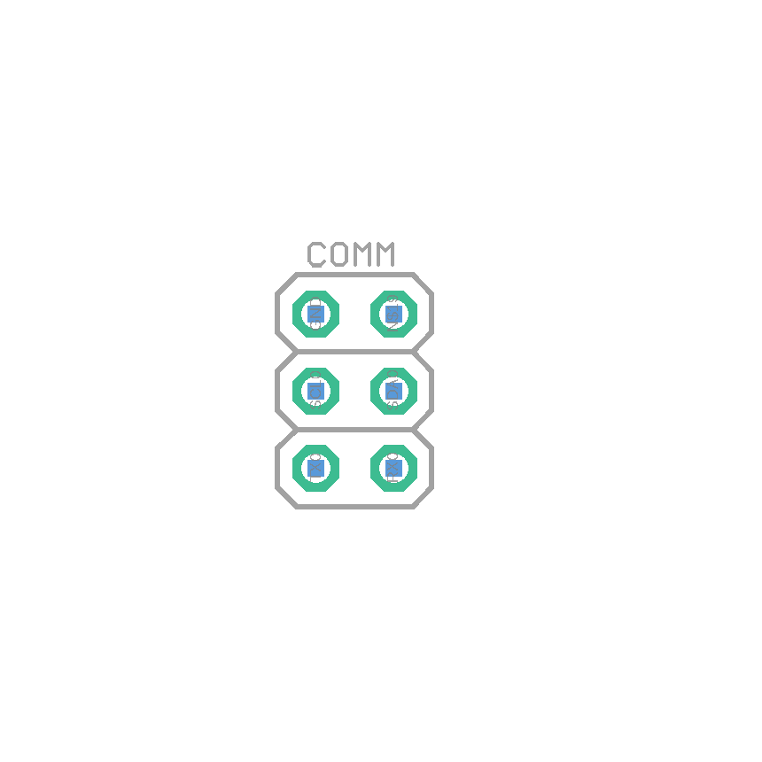
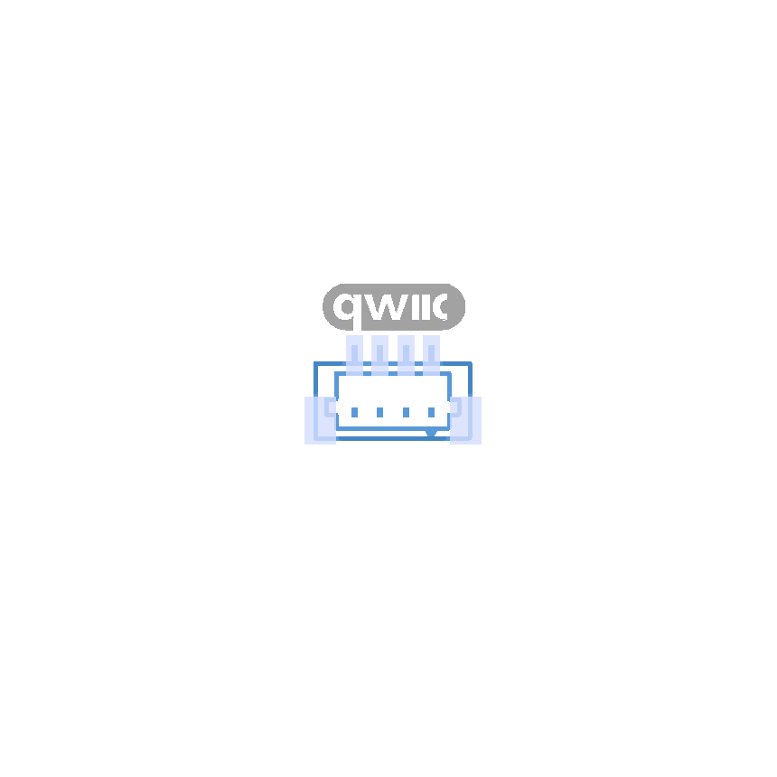
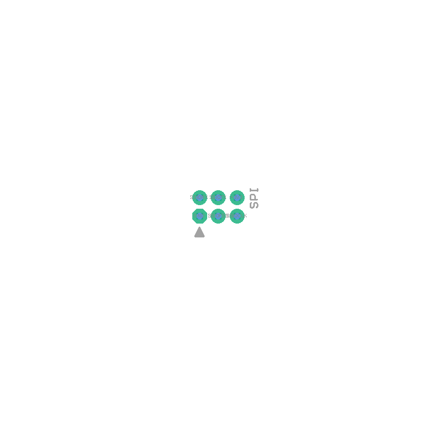
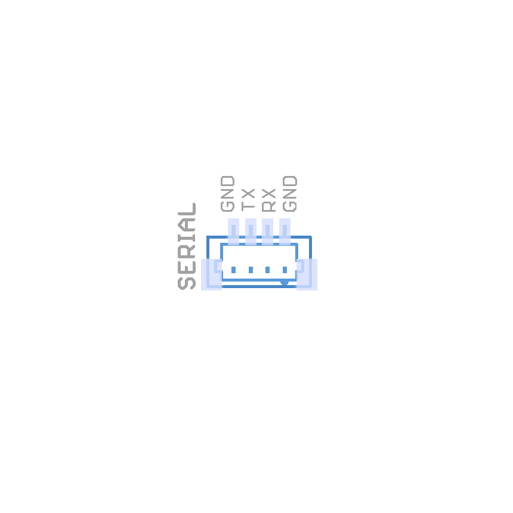
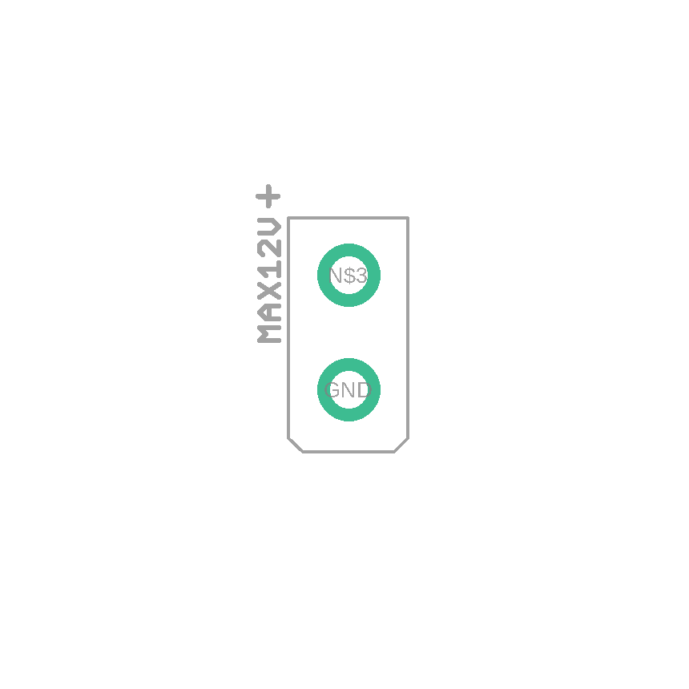

**Board Port Diagram**

Below is a diagram of ports of ROSRider control card.  
  

**List of Ports**

| -------- | ------- |
|  | Left motor connector |
|  | Right motor connector |
|  | Servo connector |
|  | AUX Power connector |
|  | Power control port |
|  | Communications port |
|  | QWIC A Port |
|  | QWIC B Port |
|  | SPI Port |
|  | Serial Port |
|  | Power Connector |
|  | Battery |

__Next Chapter:__ [Connecting ROSRider to Host Computer](../03_CONNECT/README.md)