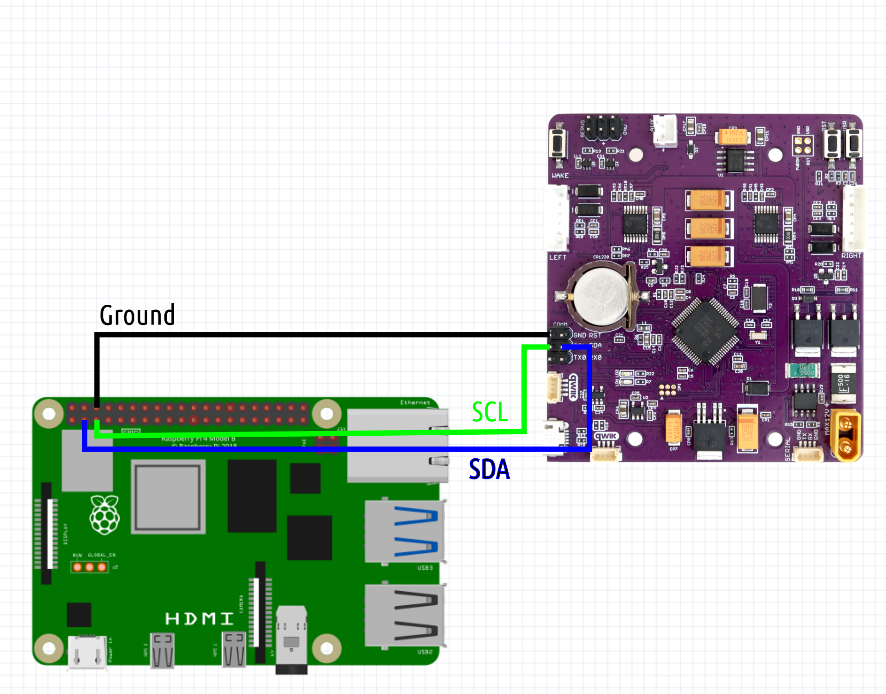
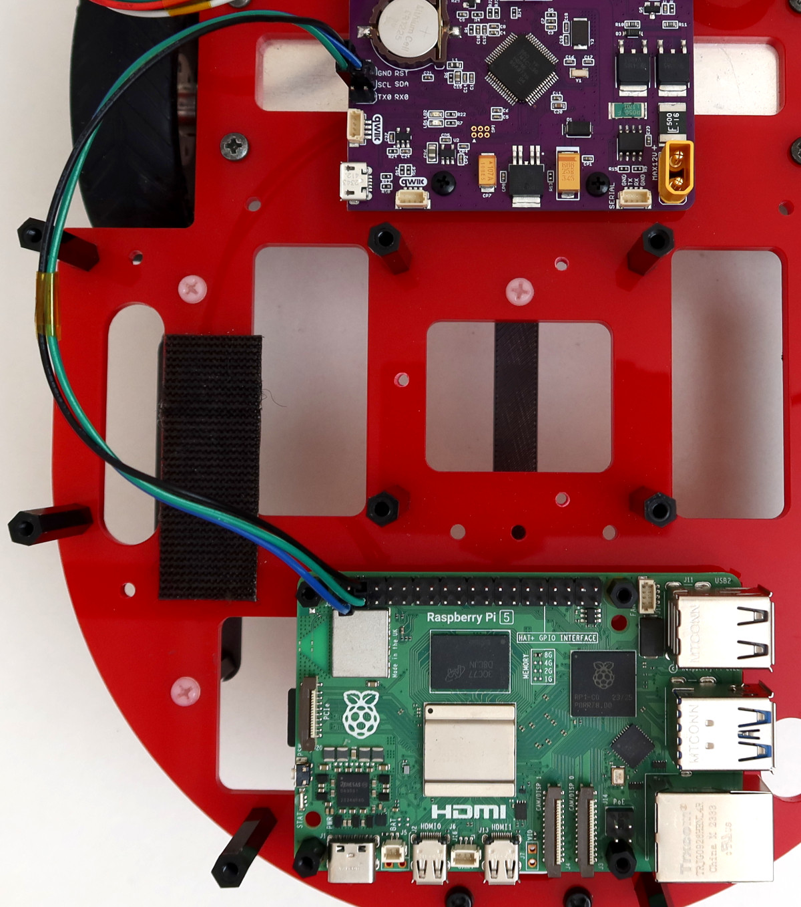
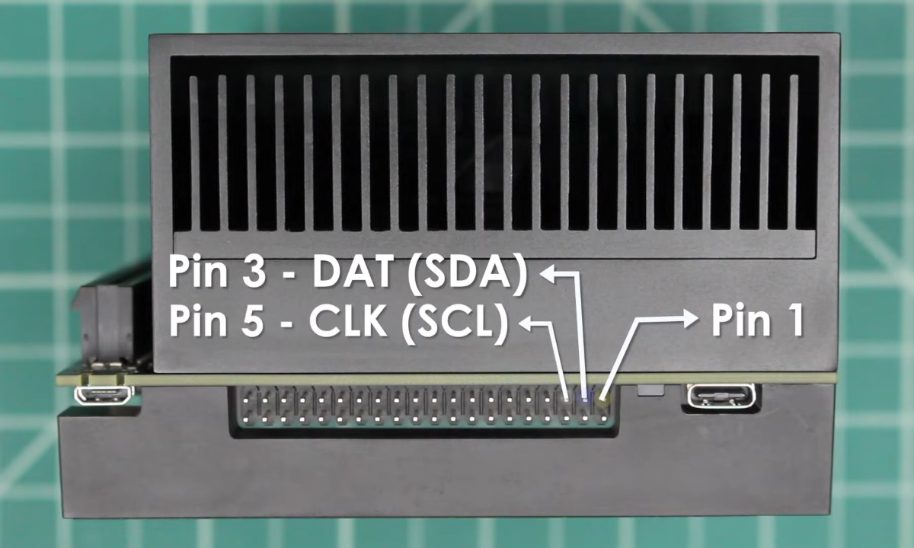
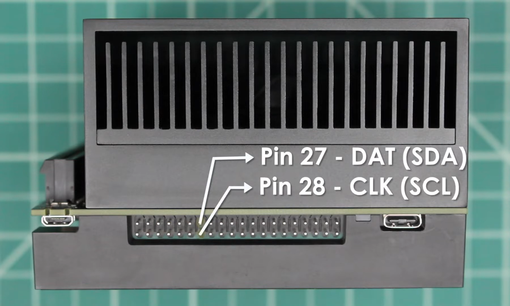

__Connecting ROSRider to Raspberry PI__

This wiring diagram illustrates direct I2C communication with the Raspberry PI.

   

This image depicts the actual wiring configuration for direct I2C communication between the Raspberry Pi and ROSRider.

   

__Connecting ROSRider to NVIDIA Jetson__

The NVIDIA Jetson has two I2C ports accessible via the header. To ensure proper communication with I2C devices, it's crucial to configure the I2C voltage level. This is accomplished using a jumper (J514) on the board. To select 3.3V I2C, position the jumper accordingly.

To ensure proper I2C communication, verify that I2C is enabled at the kernel level and that your user account has the necessary permissions to access the I2C bus on the host computer.

There are two I2C ports on the Jetson AGX:

   
   

Here is an excellent video on connecting I2C devices to Jetson: <a target="_blank" href="https://www.youtube.com/watch?v=7_H7tzcdBMU]" title="I2C - NVIDIA Jetson AGX Xavier">https://www.youtube.com/watch?v=7_H7tzcdBMU]</a>. This video provides a comprehensive guide on the steps involved, from identifying I2C pins to configuring software and starting device usage.

__Detecting I2C Devices__

For troubleshooting purposes, you may want to detect I2C devices connected to your computer. To do this, you can use the `i2cdetect` command in the terminal.

Install the `i2c-tools` package to access I2C devices:

  

    <pre id="command-install-i2ctools">sudo apt install i2c-tools</pre>
  

  <clipboard-copy style="position:absolute; right:8px; top:8px;" for="command-install-i2ctools">
    <svg aria-hidden="true" height="16" viewBox="0 0 16 16" version="1.1" width="16" data-view-component="true" class="octicon octicon-copy js-clipboard-copy-icon">
    <path d="M0 6.75C0 5.784.784 5 1.75 5h1.5a.75.75 0 0 1 0 1.5h-1.5a.25.25 0 0 0-.25.25v7.5c0 .138.112.25.25.25h7.5a.25.25 0 0 0 .25-.25v-1.5a.75.75 0 0 1 1.5 0v1.5A1.75 1.75 0 0 1 9.25 16h-7.5A1.75 1.75 0 0 1 0 14.25Z"></path><path d="M5 1.75C5 .784 5.784 0 6.75 0h7.5C15.216 0 16 .784 16 1.75v7.5A1.75 1.75 0 0 1 14.25 11h-7.5A1.75 1.75 0 0 1 5 9.25Zm1.75-.25a.25.25 0 0 0-.25.25v7.5c0 .138.112.25.25.25h7.5a.25.25 0 0 0 .25-.25v-7.5a.25.25 0 0 0-.25-.25Z"></path>
    </svg>
    <svg aria-hidden="true" height="16" viewBox="0 0 16 16" version="1.1" width="16" data-view-component="true" class="octicon octicon-check js-clipboard-check-icon color-fg-success d-none">
    <path d="M13.78 4.22a.75.75 0 0 1 0 1.06l-7.25 7.25a.75.75 0 0 1-1.06 0L2.22 9.28a.751.751 0 0 1 .018-1.042.751.751 0 0 1 1.042-.018L6 10.94l6.72-6.72a.75.75 0 0 1 1.06 0Z"></path>
    </svg>
  </clipboard-copy>

Use the i2cdetect command to scan the I2C bus and identify connected devices:

  

    <pre id="command-i2cdetect">sudo i2cdetect -y -r 1</pre>
  

  <clipboard-copy style="position:absolute; right:8px; top:8px;" for="command-i2cdetect">
    <svg aria-hidden="true" height="16" viewBox="0 0 16 16" version="1.1" width="16" data-view-component="true" class="octicon octicon-copy js-clipboard-copy-icon">
    <path d="M0 6.75C0 5.784.784 5 1.75 5h1.5a.75.75 0 0 1 0 1.5h-1.5a.25.25 0 0 0-.25.25v7.5c0 .138.112.25.25.25h7.5a.25.25 0 0 0 .25-.25v-1.5a.75.75 0 0 1 1.5 0v1.5A1.75 1.75 0 0 1 9.25 16h-7.5A1.75 1.75 0 0 1 0 14.25Z"></path><path d="M5 1.75C5 .784 5.784 0 6.75 0h7.5C15.216 0 16 .784 16 1.75v7.5A1.75 1.75 0 0 1 14.25 11h-7.5A1.75 1.75 0 0 1 5 9.25Zm1.75-.25a.25.25 0 0 0-.25.25v7.5c0 .138.112.25.25.25h7.5a.25.25 0 0 0 .25-.25v-7.5a.25.25 0 0 0-.25-.25Z"></path>
    </svg>
    <svg aria-hidden="true" height="16" viewBox="0 0 16 16" version="1.1" width="16" data-view-component="true" class="octicon octicon-check js-clipboard-check-icon color-fg-success d-none">
    <path d="M13.78 4.22a.75.75 0 0 1 0 1.06l-7.25 7.25a.75.75 0 0 1-1.06 0L2.22 9.28a.751.751 0 0 1 .018-1.042.751.751 0 0 1 1.042-.018L6 10.94l6.72-6.72a.75.75 0 0 1 1.06 0Z"></path>
    </svg>
  </clipboard-copy>

This command will display a table of I2C addresses. The default address of the ROSRider is `0x3c`, and the default address of the ROS2RPI card is `0x20`.

Note: If you only have a ROSRider connected directly, you should only see the address `0x3c`.

Once you've confirmed the presence of the ROSRider on the I2C bus, you can proceed with installing the necessary drivers.

__Next Chapter:__ [ROS2 Drivers](../04_DRIVERS/README.md)