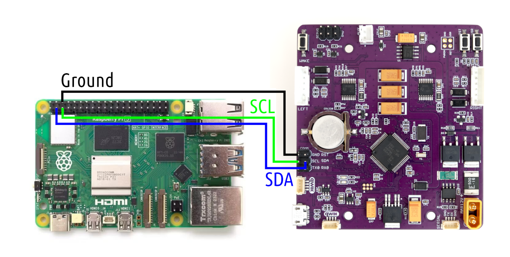

**Connecting ROSRider to Host Computer**

This wiring diagram illustrates direct I2C communication with the Raspberry PI.

This image depicts the actual wiring configuration for direct I2C communication between the Raspberry Pi and ROSRider.

__Next Chapter:__ [ROS2 Drivers](../04_DRIVERS/README.md)