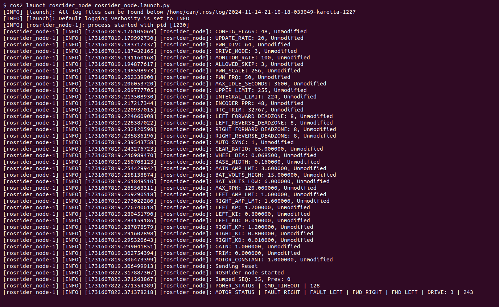
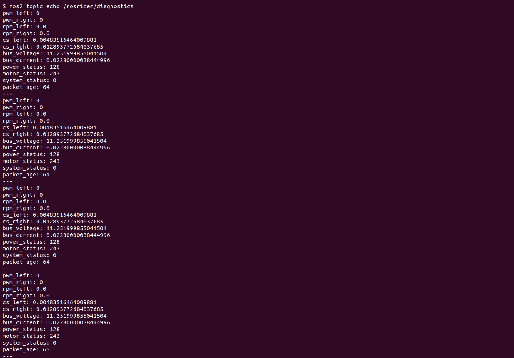

**Installing ROSRider Drivers**

The ROSRider package provides the necessary ROS nodes and drivers to interact with the ROSRider board. It allows you to control motors, read sensor data, and perform other tasks using ROS.

While previous versions of ROSRider utilized middleware to integrate with ROS, our latest iterations have transitioned to native C++ drivers. This shift eliminates the performance overhead associated with middleware, resulting in faster and more predictable system behavior. By directly interfacing with the hardware, we can optimize resource utilization and minimize latency, ensuring optimal performance for your robotics applications.

The ROSRider firmware incorporates a timing control feature that synchronizes itself to the host computer's polling rate, resulting in a latency of 1-2 milliseconds. By actively adjusting its internal clock based on received packets, the ROSRider firmware ensures precise timing and synchronization, preventing data inconsistencies and errors that can occur due to timing drifts. This guarantees that ROS packets are delivered on time, ensuring reliable and efficient system operation.

---

**Installation Instructions**

1. Create a ROS Workspace:

	```mkdir -p rosrider_ws/src```   
	```cd rosrider_ws/src```

	This creates a directory called `rosrider_ws` and a subdirectory named `src` within it. The `src` directory is the standard location for ROS package source code.

2. Clone the ROSRider Repository:

	```git clone https://github.com/acadadev/rosrider.git```

3. Initialize ROS Dependency System (if not done during ROS installation)

	```sudo rosdep init```  
	```rosdep update```

4. Install ROS Dependencies

	``cd ..``  
	``rosdep install --from-paths src -y --ignore-src``

	This command retrieves and installs all the necessary dependencies required by the ROSDriver package based on the cloned source code in the src directory.

5. Build the Workspace

	``colcon build``  
	``source devel/setup.bash``

6. Adding ROSRider to Your Bash Environment

	To ensure that your system can find the necessary ROSDriver components, you'll need to add the following line to your Bash configuration file:

	```source ~/rosrider_ws/install/setup.bash```

---

**Running the Driver**

Once you've successfully installed the ROSDriver package and configured your environment, it's time to bring the ROSRider board to life!

To launch the ROSRider node and establish communication between ROS and your ROSRider hardware, execute the following command in your terminal:

```ros2 launch rosrider_node rosrider_node.launch.py```

The following output indicates that the ROSDriver node has started successfully and is ready to communicate with your ROSRider hardware.

<div style="display: flex; margin: 25px 0;">
   
</div>

**Important Note**

- Make sure you have sourced the setup script `source devel/setup.bash` either manually before running the command, or have permanently configured it in your `.bashrc` file as explained in the previous section. This ensures the system can locate the necessary ROSDriver components.


**Monitoring diagnostics topic**

To monitor the health and performance of your ROSRider, you can view real-time diagnostic information by using the following command:

```ros2 topic echo /rosrider/diagnostics```

Running this command will output diagnostic information to your terminal. You should see an output similar to the following:

<div style="display: flex; margin: 25px 0;">
   
</div>

This command will output the following diagnostic information to your terminal:

- Motor Control: PWM values for left and right motors, and their corresponding RPMs.
- Current Sensing: Current consumption of the left and right motors.
- Power Status: Information about the battery voltage and current draw.
- System Status: Overall system health and error flags.
- Packet Age: The delay between the ROSRider and the host computer.

By monitoring these values, you can ensure optimal performance and troubleshoot any potential issues.

**Monitoring odometry output**  

To monitor the odometry data being published by the ROSRider, you can use the following command:

```ros2 topic echo /odom```


[instrumenting robot to turn lidar on off, ros2rpi]

__Next Chapter:__ [Parameters](../05_PARAMETERS/README.md)


