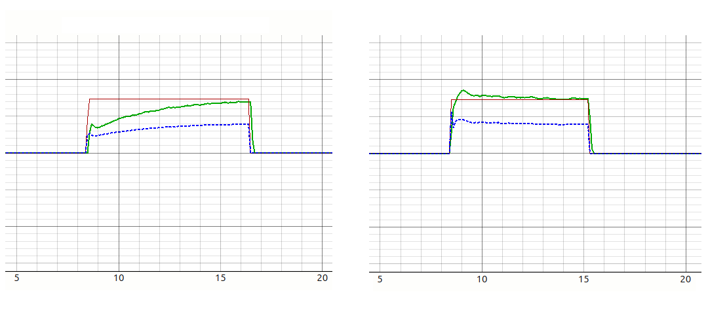
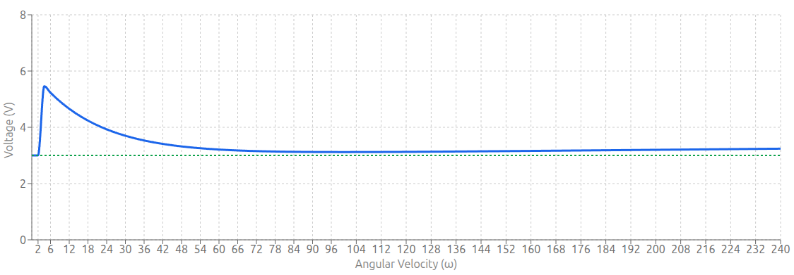
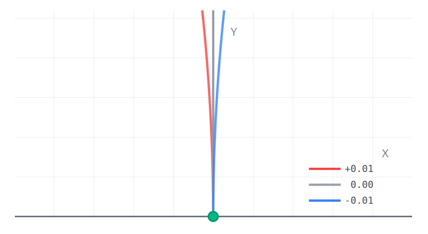
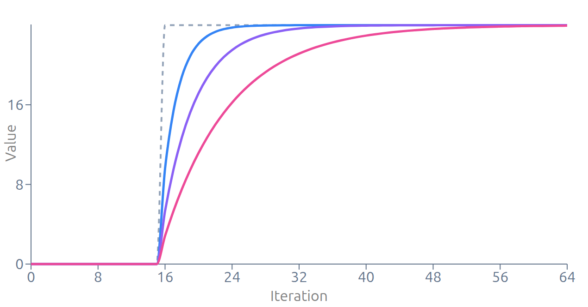

<div class="sl">
    <div class="sl1">
        > ROS Parameters
    </div>
</div>



| Parameter    | Type  | Description                         | Default |
|--------------|-------|-------------------------------------|---------|
| CONFIG_FLAGS | uint8 | Hardware Config Bitmask             | 48      |
| UPDATE_RATE  | uint8 | Outer PID Loop Update Rate          | 20      |
| DRIVE_MODE   | uint8 | Drive Mode Configuration, 3 for ROS | 3       |

__Hardware Configuration Flags__

The `CONFIG_FLAGS` parameter in the ROSRider configuration file is a bitmask that controls various hardware settings. By setting specific bits within this flag, you can configure different aspects of the ROSRider's behavior.

Here's a breakdown of the individual bits and their corresponding functionalities:

| Bit | Function      | Description                                        |
|-----|---------------|----------------------------------------------------|
| 0   | LEFT_REVERSE  | inverts the direction of the left motor            |
| 1   | RIGHT_REVERSE | inverts the direction of the left motor            |
| 2   | LEFT_SWAP     | swaps the phase order of the left encoder          |
| 3   | RIGHT_SWAP    | swaps the phase order of the left encoder          |
| 4   | LEFT_ENC_AB   | selects the AB phase encoding for the left encoder |
| 5   | RIGHT_ENC_AB  | selects the AB phase encoding for the right encode |
| 6   | MODE1         | Brake mode                                         |
| 7   | MODE2         | High side decay                                    |

The configuration flags allow you to customize the behavior of the ROSRider to match your specific hardware setup. Here's a breakdown of their functions:

- Reversing Motor Direction: The `LEFT_REVERSE` and `RIGHT_REVERSE` flags allow you to invert the direction of the motors, useful for correcting wiring mistakes or physical misorientations.
- Swapping Encoder Phases: The `LEFT_SWAP` and `RIGHT_SWAP` flags allow you to correct the phase order of the encoders, ensuring accurate position and velocity measurements.
- Selecting Encoder Mode: The `LEFT_ENC_AB` and `RIGHT_ENC_AB` flags determine whether to use AB phase encoding or single-phase encoding for the respective encoders. For AB phase encoding, both A and B phase signals are used, while for single-phase encoding, only the A phase signal is required.

By carefully configuring these flags, you can ensure that the ROSRider can work with a variety of motor and encoder configurations, providing flexibility and adaptability in your robotics projects.

__Update Rate__

`UPDATE_RATE` determines outer PID loop speed. Use 20 HZ for normal operation. Supported values are 10, 16, 20, 32, 50, 64.

__Drive Mode__

| DRIVE_MODE | Value | MODE             |
|------------|-------|------------------|
| MODE_BRAKE | 0     | Brake            |
| MODE_PWM   | 1     | PWM              |
| MODE_VEL   | 2     | Command Velocity |
| MODE_PID   | 3     | PID, ROS Default |              

__Typical Values__

```yaml
CONFIG_FLAGS: 112  
UPDATE_RATE: 20  
DRIVE_MODE: 3  
```





| Parameter | Type   | Description                         | Default |
|-----------|--------|-------------------------------------|---------|
| PWM_DIV   | uint8  | Drive Mode Configuration, 3 for ROS | 64      |
| PWM_SCALE | uint16 | Hardware Config Bitmask             | 256     |
| PWM_FRQ   | uint16 | Outer PID Loop Update Rate          | 50      |

__Understanding PWM Frequency and its Impact on Motor Control__

The PWM frequency, measured in Hertz (Hz), determines how often the power is switched on and off.
A higher frequency results in smoother motor control and reduced audible noise.
However, excessively high frequencies can lead to increased power losses and potential interference with other electronic components.  

The optimal PWM frequency depends on several factors, including:  

- Motor Type: Different motor types have different optimal frequency ranges. Brushed DC motors typically require lower frequencies, while brushless DC motors may benefit from higher frequencies
- Desired Performance: Higher frequencies can lead to smoother and quieter operation, but they may also increase power consumption and complexity of the control system
- Hardware Limitations: The microcontroller and power electronics used in the system may have limitations on the maximum achievable PWM frequency

__The Impact of PWM Frequency:__

The `PWM_FRQ` parameter in the ROSRider configuration file plays a crucial role in determining the performance and efficiency of your robot's motors.
By carefully selecting this value, you can optimize motor smoothness, responsiveness, power consumption, and electromagnetic interference (EMI).  

A higher PWM frequency generally leads to:

- Smoother Motor Operation: More frequent switching reduces motor torque ripple.
- Improved Responsiveness: Faster reaction to control inputs.

However, a higher frequency can also result in:

- Increased Power Dissipation: More switching losses in the motor driver.
- Higher EMI: Increased electromagnetic interference.

To achieve the desired PWM frequency, you'll need to set the `PWM_DIV` parameter appropriately.
This parameter divides the system clock to generate the PWM clock. A higher `PWM_DIV` value results in a lower PWM clock frequency.  

- This setting determines the clock frequency for the PWM module.
- It's a hardware-based division of the system clock. (80000000)

__Practical Considerations:__

- Start with a Moderate Frequency: Begin with a moderate PWM frequency and gradually increase it if needed.
- Monitor Motor Performance: Observe the motor's behavior and adjust the frequency accordingly.
- Consider Power Dissipation and EMI: If power consumption or EMI becomes a concern, reduce the PWM frequency.
- Experiment and Fine-Tune: The best PWM frequency may vary depending on your specific application
- Synchronized ADC: Limit PWM Frequency. 1-2kHZ
- Minimum PWM Frequency: Use 50 HZ
- Maximum PWM Frequency: Use 18000 HZ, if using high > 2 kHZ, disable `ADC_SYNC`.

By carefully considering these factors and adjusting the `PWM_DIV` and `PWM_FRQ` parameters, you can optimize your ROSRider's performance and efficiency.

__Typical Values__

```yaml
PWM_DIV: 16  
PWM_SCALE: 256  
PWM_FRQ: 1000  
```





| Parameter   | Type   | Description                   | Default |
|-------------|--------|-------------------------------|---------|
| GEAR_RATIO  | float  | Gear ratio of the motors      | 65.0    |
| ENCODER_PPR | uint16 | Encoder pulses per revolution | 48      |
| WHEEL_DIA   | float  | Diameter of the wheels        | 0.0685  |
| BASE_WIDTH  | float  | Distance between the wheels   | 0.168   |
| MAX_RPM     | float  | Distance between the wheels   | 90.0    |

__Motor & Encoder Specifications__

These parameters define the mechanical properties of the drive motors and are foundational to the robot's kinematic model,
serving as the basis for converting raw encoder feedback into physical wheel movement.

  - `GEAR_RATIO` The reduction ratio of the gearbox attached to the motor.
  - `ENCODER_PPR` The raw pulses per revolution measured at the motor shaft (before the gearbox).

__Chassis Geometry__

These parameters define the physical dimensions of the robot base, essential for converting wheel velocities into robot velocities (inverse kinematics).

  - `WHEEL_DIA` This parameter acts as the scalar for converting rotational motion (motor RPM or encoder ticks) into linear displacement. It is fundamental to the odometry calculation, defining the wheel circumference `C = 𝜋 * D`
  - `BASE_WIDTH` Used to calculate the robot's angular velocity (ω) and turning radius (𝑅). A smaller base width results in faster rotation for the same wheel speed differential.

__Control Limits__

  - `MAX_RPM` The maximum output shaft speed defined in RPM for readability, used to normalize control inputs and cap velocity commands before conversion to the system's native `rad/s`.

__Typical Values__

```yaml
GEAR_RATIO: 65.0  
ENCODER_PPR: 48  
WHEEL_DIA: 0.0685  
BASE_WIDTH: 0.174  
MAX_RPM: 160.0  
```





| Parameter   | Type   | Description                      | Default |
|-------------|--------|----------------------------------|---------|
| UPPER_LIMIT | uint16 | Maximum Controller PWM output    | 192     |
| LEFT_KP     | float  | PID proportional for left motor  | 2.4     |
| LEFT_KI     | float  | PID integral for left motor      | 1.2     |
| LEFT_KD     | float  | PID differential for left motor  | 0.0     |
| RIGHT_KP    | float  | PID proportional for right motor | 2.4     |
| RIGHT_KI    | float  | PID integral for right motor     | 1.2     |
| RIGHT_KD    | float  | PID differential for right motor | 0.0     |
| K_FB_WINDUP | float  | Anti windup coefficient          | 0.5     |

__Control Loop Parameters__

These parameters govern the closed-loop velocity control for the drive motors.
The system uses a classic PID controller with a back-calculation anti-windup
strategy to manage integrator saturation.  

__Coefficients__

Standard tuning constants for the outer velocity loop.
These values determine how aggressively the motor corrects errors between
the target velocity and the actual velocity.  

 - `LEFT_KP` / `RIGHT_KP` Determines the immediate reaction to the current error. A higher value provides a faster response but may cause oscillation.
 - `LEFT_KI` / `RIGHT_KI` Accumulates past errors to eliminate steady-state offset, ensuring the motor reaches the exact target speed over time.
 - `LEFT_KD` / `RIGHT_KD` Predicts future error based on the rate of change, acting as a damper to reduce overshoot and oscillation.

__Output Constraints & Saturation__

 - `UPPER_LIMIT` Hard caps the controller output to match the physical limits of the motor driver or to limit maximum voltage.

__Anti Windup__

 - `K_FB_WINDUP` A **feed-back** gain used to dynamically desaturate the integral term. When the calculated PWM output exceeds `UPPER_LIMIT`, the difference (excess) is multiplied by `K_FB_WINDUP` and subtracted from the integral accumulator.

__Typical Values__

```yaml
UPPER_LIMIT: 240  
LEFT_KP: 8.0  
LEFT_KI: 6.0  
LEFT_KD: 0.0  
RIGHT_KP: 8.0  
RIGHT_KI: 6.0  
RIGHT_KD: 0.0  
K_FB_WINDUP: 0.5  
```





| Parameter               | Type    | Description                           | Default |
|-------------------------|---------|---------------------------------------|---------|
| CASCADED                | boolean | Cascaded Inner Loop Enabled           | False   |
| INNER_LIMIT             | uint16  | Maximum Controller PWM output         | 192     |
| CURRENT_KP              | float   | Inner Loop Current Error Proportional | 2.4     |
| CURRENT_KI              | float   | Inner Loop Current Error Integral     | 1.2     |
| CURRENT_MULTIPLIER_LEFT | float   | Current Multiplier Left               | 4.8     |
| CURRENT_MULTIPLIER_LEFT | float   | Current Multiplier Right              | 4.8     |
| CURRENT_OMEGA_K_LEFT    | float   | Current Omega Compensation Left       | 0.0     |
| CURRENT_OMEGA_K_RIGHT   | float   | Current Omega Compensation Right      | 0.0     |
| R_ARM                   | float   | Motor Armature Resistance             | 2.0     |

These plots below compare the step response of a **classic PID controller** (left)
versus a **cascaded PID** with feedforwards and stribeck friction modeling (right).
The control scheme on the right demonstrates significantly tighter tracking,
eliminating the lag and slow rise time seen in the classic implementation.  



__Cascaded control architecture__

The outer loop calculates a current setpoint, which is then tracked by the inner PI loop. 
This allows for direct torque control and faster disturbance rejection.

 - `CASCADED` Enables or disables the Cascaded Loop.
 
__Loop Constraints & Calibration__

 - `INNER_LIMIT` The maximum allowable PWM duty cycle for the current loop output.
 - `CURRENT_LEFT_MULTIPLIER` / `CURRENT_MULTIPLIER_RIGHT` A multiplier applied to the raw current sensor reading to match the scale of the current reference setpoint.
 - `CURRENT_OMEGA_K_LEFT` / `CURRENT_OMEGA_K_RIGHT` These values are added to or subtracted from the base multiplier, scaled linearly as speed increases from 0 to ω max. This corrects for drift or gain changes in the current sensing circuit at high rotational speeds.

__PI Controller__

 - `CURRENT_KP` The proportional term for the inner PI loop, reacting to the immediate difference between the current reference and the measured current.
 - `CURRENT_KI` The integral term for the inner PI loop. It accumulates error over time to ensure the measured current accurately tracks the current reference setpoint.

__Armature Resistance__ 

These parameters model the physical characteristics of the DC motors.
Accurate modeling here improves the feedforward performance and odometry estimation.  

 - `R_ARM` Used to calculate the voltage drop required to drive a specific current. ( 𝑉 = 𝐼 × 𝑅 )

__Torque Constant & Back-EMF Model__

| Parameter  | Type  | Description                              | Default |
|------------|-------|------------------------------------------|---------|
| LEFT_KT    | float | Torque Constant for Left Motor           | 0.016   |
| LEFT_KT_W  | float | Torque Constant Omega Compensation Left  | -0.008  |
| RIGHT_KT   | float | Torque Constant for Right Motor          | 0.016   |
| RIGHT_KT_W | float | Torque Constant Omega Compensation Right | -0.008  |

In the cascaded control mode, the system estimates the Back Electromotive Force (Back-EMF) generated by
the spinning motor. This voltage estimate is added to the controller output as a feedforward term,
allowing the PID loop to focus solely on driving the required current rather than overcoming
the motor's generated voltage.

 - `LEFT_KT` / `RIGHT_KT` The constant used to calculate the Back-EMF voltage from the motor's angular velocity (ω) when the motor is beginning to spin.
 - `LEFT_KT_W` / `RIGHT_KT_W` A compensation factor that adjusts the Torque Constant linearly as the motor speed increases toward its maximum.

__Typical Values__

```yaml
CASCADED: True  
INNER_LIMIT: 240  
CURRENT_KP: 8.0  
CURRENT_KI: 6.0  
CURRENT_MULTIPLIER_LEFT: 4.8  
CURRENT_MULTIPLIER_RIGHT: 4.8  
CURRENT_OMEGA_K_LEFT: -2.4  
CURRENT_OMEGA_K_RIGHT: -2.4  
R_ARM: 2.0  
```

```yaml
LEFT_KT: 0.016
LEFT_KT_W: -0.008
RIGHT_KT: 0.016
RIGHT_KT_W: -0.008
```





| Parameter         | Type    | Description                    | Default |
|-------------------|---------|--------------------------------|---------|
| OUTER_FEEDFORWARD | boolean | Enable Outer Loop Feed-forward | False   |
| K_FF_VEL          | float   | Velocity Feed-forward / s      | 0.16    |
| K_FF_ACCEL        | float   | Acceleration Feed-forward / s² | 0.12    | 

__Physics Feed-Forwards (Outer Loop)__

Adds predictive control signals to the outer loop.
Instead of waiting for an error to develop (as PID does),
feed-forward uses the physics of the robot to **guess** the required output for a given target
velocity and acceleration. This significantly reduces lag during rapid speed changes.

 - `OUTER_FEEDFORWARD` Enables or disables the physics-based feed-forward terms in the outer control loop.

__Coefficients__

 - `K_FF_VEL` Adds output power proportional to the target velocity to compensate for kinetic friction.
 - `K_FF_ACCEL` Adds output power proportional to the requested acceleration.

<div class="ck">
    <div class="ck2">
        Velocity Feed-Forward is NOT used in Cascaded Mode. 
        In Cascaded mode, the inner loop's Back-EMF estimator already
        calculates and fights back against the induced voltage,
        making this external feed-forward redundant.
    </div>
</div>

__Typical Values__

```yaml
OUTER_FEEDFORWARD: True
K_FF_VEL: 0.12  
K_FF_ACCEL: 0.08  
```





| Parameter              | Type    | Description                                            | Default |
|------------------------|---------|--------------------------------------------------------|---------|
| OUTER_SCV              | boolean | Enable SCV if not deadzone will be used                | False   |
| STATIC_KICK            | float   | Initial Kick in Volts                                  | 6.0     |
| COULOMB_RUN            | float   | Minimum energy for motor to turn in Volts              | 3.0     |
| STRIBECK_WIDTH         | float   | Statick Kick Decay rate                                | 64      | 
| VISCOUS_FRICTION       | float   | Viscous Friction Coefficient                           | 0.001   | 
| VISCOUS_FRICTION_LIMIT | float   | Viscous Friction Limit                                 | 1.2     | 
| EB_FF_LIMIT            | float   | Calculated BEMF Limit in Volts                         | 12.0    | 
| SCV_OMEGA_THRESHOLD    | float   | Below this threshold SCV will not be triggered         | 0.05    | 
| SCV_LATCH_THRESHOLD    | float   | Below this threshold Static kick will not be triggered | 1.0     | 

__Advanced Friction Compensation (Stribeck Model)__

This model implements a comprehensive physics-based friction model entirely within the outer **PID loop.**
By preemptively calculating the voltage required to overcome mechanical resistance, it allows the
controller to break stiction and maintain motion without waiting for integral error to build up.

The model dynamically calculates a feedforward voltage that decays exponentially from a high 
**Static Kick** down to a steady **Coulomb level** as speed increases, while simultaneously adding a linear **Viscous** term.

To prevent jitter at very low speeds, the model features a specific gating mechanism controlled by 
`SCV_LATCH_THRESHOLD`.  

 - **Above Threshold:** The full Stribeck model is active. (Static Kick + Coulomb + Viscous)
 - **Below Thrshold:** The aggressive static kick and viscous terms are **disabled.** Only the constant `COULOMB_RUN` voltage is applied. This prevents low-speed oscillation while maintaining sufficient holding force to keep the robot ready to move.

__Friction Compensation Voltage vs Angular Velocity__

The graph below shows the total added friction volts as a function of angular velocity. `STATIC_KICK = 6V`, `STRIBECK_WIDTH = 16`, `COULOMB_RUN = 3V`, `VISCOUS_FRICTION = 0.001`, `SCV_LATCH_THRESHOLD = 2 rad/s`



__Parameters__

 - `OUTER_SCV` Enables SCV Model. If `False` simple dead zones are applied.
 - `STATIC_KICK` The high initial voltage spike required to break static friction (stiction) when starting motion. This is the peak value of the exponential curve.
 - `COULOMB_RUN` The **floor** voltage required to keep the motor spinning at the lowest possible non-zero speed. When velocity is below the latch threshold, this is the only voltage applied.
 - `STRIBECK_WIDTH` The exponential decay rate. A higher value causes the **Static Kick** to fade away more sharply as the robot accelerates, transitioning quickly to the Coulomb level.
 - `VISCOUS_FRICTION` The linear friction coefficient. Accounts for resistance that scales with speed. (e.g., grease viscosity, floor drag)
 - `SCV_LATCH_THRESHOLD` The low-speed safety gate. When velocity (ω) is below this value, the Static Kick and Viscous terms are disabled to prevent oscillation, leaving only the steady Coulomb Run voltage.
 - `VISCOUS_FRICTION_LIMIT` Hard limits the maximum voltage contribution from the viscous friction term.
 - `EB_FF_LIMIT` Limits the maximum voltage that the Back-EMF estimator is allowed to inject into the controller.
 - `SCV_OMEGA_THRESHOLD` Zero-Velocity Noise Gate. A cutoff value below which the target velocity (ω) is mathematically treated as exactly **0.0**.

<div class="ck">
    <div class="ck2">
      When the advanced Stribeck Compensation Velocity (SCV) model is disabled,
      these parameters define a constant PWM offset that is added to the motor output to linearly
      overcome static friction and hardware deadbands.  
    </div>
</div>

| Parameter              | Type  | Description                  | Default |
|------------------------|-------|------------------------------|---------|
| LEFT_FORWARD_DEADZONE  | int16 | Left Motor Forward Deadzone  | 0       |
| LEFT_REVERSE_DEADZONE  | int16 | Left Motor Reverse Deadzone  | 0       |
| RIGHT_FORWARD_DEADZONE | int16 | Right Motor Forward Deadzone | 0       |
| RIGHT_REVERSE_DEADZONE | int16 | Right Motor Reverse Deadzone | 0       |

__Typical Values__

```yaml
OUTER_SCV: True
STATIC_KICK: 0.8  
COULOMB_RUN: 0.2  
STRIBECK_WIDTH: 2.1  
VISCOUS_FRICTION: 0.064  
VISCOUS_FRICTION_LIMIT: 1.2  
EB_FF_LIMIT: 12.0  
SCV_OMEGA_THRESHOLD: 0.05  
SCV_LATCH_THRESHOLD: 1.0  
```

```yaml
LEFT_FORWARD_DEADZONE: 12  
LEFT_REVERSE_DEADZONE: 12  
RIGHT_FORWARD_DEADZONE: 12  
RIGHT_REVERSE_DEADZONE: 12  
```





| Parameter     | Type  | Description                           | Default |
|---------------|-------|---------------------------------------|---------|
| TRIM_GAIN     | float | Overall Gain Factor                   | 1.0     |
| TRIM_MOTOR_K  | float | Motor constant for output calculation | 1.0     |
| TRIM_CONSTANT | float | Trim value for motor output           | 1.0     |

__Trim Model__

In the context of motor control, the motor constant is a proportionality factor that relates the input voltage to the output speed or torque. By adjusting the motor constant, we can compensate for differences in motor performance, such as variations in motor efficiency or mechanical load.
The trim parameter, on the other hand, is used to introduce a small offset to the motor's output. This can be helpful in compensating for slight misalignments in the robot's mechanical structure or differences in motor characteristics.

In the given equations:

```c
MotorConstantLeft = (GAIN + TRIM) / MOTOR_CONSTANT;
MotorConstantRight = (GAIN - TRIM) / MOTOR_CONSTANT;
```

The `MotorConstantLeft` and `MotorConstantRight` values are used to multiply the algorithm output (typically from a PID controller) to determine the appropriate PWM values for the left and right motors. These adjusted motor constants account for variations in motor performance and mechanical factors, ensuring precise and coordinated motor control.

- `MotorConstantLeft` and `MotorConstantRight` are the adjusted motor constants for the left and right motors.
- `TRIM_GAIN` is a global gain factor that scales the overall motor output.
- `TRIM_MOTOR_K` is the nominal motor constant.
- `TRIM_CONSTANT` is a small value used to adjust the motor output.

By adjusting the TRIM parameter, we can effectively fine-tune the motor outputs to ensure accurate and precise robot motion, even in the presence of minor variations in motor performance or mechanical alignment.



This image above demonstrates how the TRIM parameter affects differential drive robot trajectory:
a positive TRIM value (+0.01) increases the left motor constant relative to the right,
causing the robot to curve left (red path), while a negative TRIM value (-0.01) has the opposite effect,
curving the robot right (blue path), and zero TRIM (0.00) results in straight-line motion (gray path)
with equal motor constants.  

__Typical Values__

```yaml
TRIM_GAIN: 1.0  
TRIM_MOTOR_K: 1.0  
TRIM_CONSTANT: 0.0  
```





| Parameter           | Type  | Description          | Default |
|---------------------|-------|----------------------|---------|
| OMEGA_FILTER_TYPE   | uint8 | Velocity Filter Type | 1       |
| CURRENT_FILTER_TYPE | uint8 | Current Filter Type  | 3       |
| OUTPUT_FILTER_TYPE  | uint8 | Output Filter Type   | 0       | 

__Velocity Measurement Filter__

This filter processes the raw velocity feedback (ω) calculated from the encoders.
Filtering here is critical because differentiation of encoder ticks often produces discrete, **step-like**
noise that can destabilize the PID loop.

| Name            | ID | Type           | Details                                                                                   |
|-----------------|----|----------------|-------------------------------------------------------------------------------------------|
| NONE            | 0  | N / A          | No Filter                                                                                 |
| EWMA4           | 1  | EWMA           | Exponentially Weighted Moving Average.  Low lag, light smoothing (Last 4 samples)         | 
| EWMA8           | 2  | EWMA           | Exponentially Weighted Moving Average (Last 8 samples)                                    |
| EWMA16          | 3  | EWMA           | Exponentially Weighted Moving Average (Last 16 samples)                                   |
| BIQUAD_20HZ_2HZ | 4  | Bi-Quad Filter | 2nd Order Low-Pass Filter. Cutoff at 2Hz. (assuming 20Hz loop) aggressive noise rejection |
| BIQUAD_20HZ_4HZ | 5  | Bi-Quad Filter | 2nd Order Low-Pass Filter. Cutoff at 4Hz.                                                 |

__Filter Types Explained__

 - **EWMA** (Exponentially Weighted Moving Average) A computationally efficient filter that gives more weight to recent data.
   - Pros: Very fast to calculate, good for general noise.
   - Cons: Can introduce lag if the window size (4, 8, 16) is too large.
   
 - **Bi-Quad** (Biquadratic Filter) A second-order recursive linear filter.
   - Pros: Capable of sharp cutoffs (removing specific frequencies) better than EWMA.
   - Cons: More complex; incorrect configuration can lead to instability.



<div class="ck">
    <div class="ck1">
      ⚠️&nbsp;Critical WARNING
    </div>
    <div class="ck2">
        The Biquad filter implementation is mathematically tuned strictly for a 20Hz update configuration. Do not use them with other update rates.
    </div>
</div>

__Current Measurement Filter__

This filter processes the noisy analog data from the current sensors before it enters the inner current loop.
High-frequency noise here is common due to PWM switching and brush arcing.

| Name   | ID | Filter Type | Details                                                 |
|--------|----|-------------|---------------------------------------------------------|
| NONE   | 0  | N / A       | No Filter                                               |
| EWMA4  | 1  | EWMA        | Exponentially Weighted Moving Average (Last 4 samples)  | 
| EWMA8  | 2  | EWMA        | Exponentially Weighted Moving Average (Last 8 samples)  |
| EWMA16 | 3  | EWMA        | Exponentially Weighted Moving Average (Last 16 samples) |

<div class="ck">
    <div class="ck1">
      ⚠️&nbsp;Software Fuses
    </div>
    <div class="ck2">
        When the current filter is disabled or set to a low EWMA,
        sensor noise spikes may inadvertently trigger software fuses;
        consider increasing software fuse thresholds to compensate if this configuration is required.  
    </div>
</div>

__Output Filter__

This filter is applied to the final output of the control loop before it is sent to the motors. 
It is typically used to **sharpen** the response or map the linear PID output to a non-linear actuator curve.

| Name | ID | Filter Type |
|------|----|-------------|
| None | 0  | None        |
| TANH | 1  | Tanh        |
| SIGM | 2  | Sigmoid     |

__Output Filter Scalers__

| Parameter | Type  | Description                                                  | Default |
|-----------|-------|--------------------------------------------------------------|---------|
| TANH_DIV  | float | Divider to scale the Tanh input range. Controls curve width. | 2.0     |
| SIGM_DIV  | float | Divider to scale the Sigmoid input range.                    | 10.0    |

The Output Filter applies a non-linear transformation (Hyperbolic Tangent or Sigmoid) to the final
control signal, creating a **soft clipping** effect that smooths out aggressive commands near the
maximum limit. The shape of this response curve is tunable via divisor parameters (`TANH_DIV`, `SIGM_DIV`),
allowing you to adjust how sharply the motor power saturates.  

__Output Filters Explained__

 - **TANH** (Hyperbolic Tangent) A symmetric S-shaped transfer function that creates a **soft clip** effect. It is linear for small errors but smoothly saturates as the output approaches the limit.
 - **SIGM** (Sigmoid) A non-linear activation function that maps the control signal to a gradual S-curve.

__Filter Routing Configuration__

This section controls Filter Routing. It determines whether the motor controller uses **Raw** (noisy, fast) or **Filtered** (smooth, slightly delayed) sensor data for specific calculations.

For every calculation below, you have a binary choice:
 - `False` **Raw Data**: The controller sees the sensor data exactly as it happens. It is instant but can be "jittery" or noisy.
 - `True` **Filtered Data**: The controller sees a smoothed-out version of the data. It eliminates noise but reacts slightly slower (milliseconds of delay).

| Parameter            | Type    | Description                                           | Default |
|----------------------|---------|-------------------------------------------------------|---------|
| VOLTAGE_FILTER       | boolean | Use Filtered voltage for Cascaded Loop Calculations   | False   |
| BEMF_FILTERED_OMEGA  | boolean | Use Filtered Omega for Cascaded Loop Calculations     | False   |
| PID_FILTERED_OMEGA   | boolean | Use Filtered Omega for PID Error Calculations         | False   |
| SCV_FILTERED_OMEGA   | boolean | Use Filtered Omega for SCV Model                      | False   |
| CURRENT_OMEGA_FILTER | boolean | Use Filterd Omega for Current Multiplier Compensation | False   |

__Typical Values__

```yaml
OMEGA_FILTER_TYPE: 1  
CURRENT_FILTER_TYPE: 3  
OUTPUT_FILTER_TYPE: 0  
```

```yaml
TANH_DIV: 2.0  
SIGM_DIV: 10.0  
```

```yaml
VOLTAGE_FILTER: True  
BEMF_FILTERED_OMEGA: True  
PID_FILTERED_OMEGA: True  
SCV_FILTERED_OMEGA: True  
CURRENT_OMEGA_FILTER: True  
```





| Parameter      | Type    | Description                                          | Default |
|----------------|---------|------------------------------------------------------|---------|
| AUTO_BIAS      | boolean | Auto Bias Enabled                                    | True    |
| ADC_SYNC       | boolean | ADC Syncronized with PWM. Required for Cascaded Mode | False   |
| ADC_MULTIPHASE | boolean | Multi-Phase ADC Measurement. BEMF compensated Mode   | False   |
| ADC_BIPHASE    | boolean | Bi-Phase ADC Measurement                             | False   |

__ADC & Calibration Configuration__

This section controls how the microcontroller calibrates its sensors and synchronizes its analog
measurements (ADC) with the motor's power output (PWM). Correct configuration here is vital
for clean current sensing.  

 - `AUTO_BIAS` When the robot is stationary (not in motion), the system measures the sensor output to find the **zero** point, automatically updating `CS_LEFT_OFFSET` and `CS_RIGHT_OFFSET`.
 - `ADC_SYNC` Triggers the ADC sample exactly in the middle of the PWM **ON** pulse. This avoids switching noise at the edges. Required for Cascaded Mode.
 - `ADC_MULTIPHASE` Measures at **ON**, **OFF**, and Middle points to reconstruct the current curve. It integrates the curve but specifically excludes the **OFF** time readings from the total, compensating for **Back-EMF** effects.
 - `ADC_BIPHASE` Samples the signal twice: once in the middle of the PWM **ON** time and once in the middle of the **OFF** time.

__ADC Bias Calibration__

| Parameter       | Type  | Description                           | Default |
|-----------------|-------|---------------------------------------|---------|
| CS_LEFT_OFFSET  | int16 | Current Sense Calibration Value Left  | 0       |
| CS_RIGHT_OFFSET | int16 | Current Sense Calibration Value Right | 0       |

This section contains the static calibration values for the current sensors.
These are hardcoded integer offsets used to **zero out** the sensors if `AUTO_BIAS` is 
disabled or if fine-tuning is required.

__Typical Values__

```yaml
AUTO_BIAS: True  
ADC_SYNC: True  
ADC_MULTIPHASE: True  
ADC_BIPHASE: False
```

```yaml
CS_LEFT_OFFSET: 0  
CS_RIGHT_OFFSET: 0  
```





| Parameter     | Type    | Description                                                                                               | Default |
|---------------|---------|-----------------------------------------------------------------------------------------------------------|---------|
| AUTO_SYNC     | boolean | Enables the automatic timer frequency adjustment logic.                                                   | True    |
| SYNC_KP       | uint16  | How hard the timer corrects for immediate phase errors.                                                   | 256     |
| SYNC_KI       | uint16  | How strictly the timer compensates for long-term drift (accumulated error).                               | 4       |
| SYNC_LIMIT    | uint16  | The maximum amount the timer period can be changed in a single step. Prevents instability.                | 4096    |
| SYNC_INTERVAL | uint8   | Defines how often the sync logic runs (e.g., 8 means check and adjust every 8th loop cycle).              | 8       |
| DT_I2C        | uint16  | The desired delay between the sync event and the loop start.                                              | 32      |
| DT_THRESHOLD  | uint16  | If the phase error is less than this value (in ticks), no adjustment is made. Prevents hunting or jitter. | 2       |

This feature functions as a software-based Phase Locked Loop (PLL).
It synchronizes the device's internal interrupt timer with an external 
event stream (typically I2C communication packets) to prevent clock drift.  

__The Core Concept: Clock Drift Synchronization__

Even with high-precision crystals, two separate devices will eventually drift apart.
This feature measures the **Phase Error**
(the time difference between when an I2C packet arrives and when the internal loop starts)
and dynamically adjusts the Interrupt Timer Frequency to keep them locked together.  

The system targets a specific delay `DT_I2C` rather than zero delay.
This ensures the calculation loop always starts exactly 1ms (32 ticks) after data reception,
guaranteeing fresh data is available without race conditions.  

__Typical Values__

```yaml
AUTO_SYNC: True  
SYNC_KP: 256  
SYNC_KI: 4  
SYNC_LIMIT: 4096  
SYNC_INTERVAL: 8  
DT_I2C: 32  
DT_THRESHOLD: 2  
```





| Parameter       | Type   | Description                                     | Default          |
|-----------------|--------|-------------------------------------------------|------------------|
| ODOM_FRAME_ID   | string | Sets the frame ID for the odometry data         | `odom`           |
| BASE_FRAME_ID   | string | Sets the frame ID for the robot's base frame    | `base_footprint` |
| CMD_VEL_TOPIC   | string | Command Topic Name                              | `cmd_vel`        |
| BROADCAST_TF2   | bool   | Enables or disables TF2 broadcast               | True             |
| PUB_ODOMETRY    | bool   | Enables or disables odometry data publication   | True             |
| PUB_JOINTS      | bool   | Enables or disables joint state publication     | True             |
| PUB_DIAGNOSTICS | bool   | Enables or disables diagnostic data publication | True             |

This section defines how the driver interacts with the ROS, 
including the TF Tree (coordinate frames), Topic Names, and Data Publishing toggles.

**Coordinate Frames & TF Tree**

These parameters define the naming convention for the robot's coordinate systems.
The driver uses these IDs when constructing the standard `nav_msgs/Odometry` packet.
The `header.frame_id` will be set to `ODOM_FRAME_ID` and the `child_frame_id` will be set to `BASE_FRAME_ID`.  

 - `ODOM_FRAME_ID` The driver publishes the transform from this frame to the main frame.
 - `BASE_FRAME_ID` The name of the frame for the mobile robot.

**Data Publishing Toggles**

These booleans act as switches for the driver's output streams.
You can disable specific streams to save bandwidth or avoid conflicts.

 - `BROADCAST_TF2` Set to `False` if you are using an external localizer (like `robot_localization` or `cartographer`) to handle the TF tree.
 - `PUB_ODOMETRY` Decides if the driver publishes `nav_msgs/Odometry` messages containing position and velocity covariance.
 - `PUB_JOINTS` Required for `robot_state_publisher` to visualize wheel rotation in URDF / RViz.
 - `PUB_DIAGNOSTICS ` Decides if the driver publishes `msg/Diagnostics.msg` containing battery voltage, error flags, and internal status.

__Typical Values__

```yaml
ODOM_FRAME_ID: 'odom'  
BASE_FRAME_ID: 'base_footprint'  
CMD_VEL_TOPIC: 'cmd_vel_nav'  
BROADCAST_TF2: True  
PUB_ODOMETRY: True  
PUB_JOINTS: True  
PUB_DIAGNOSTICS: True  
```





| Parameter       | Type   | Description                                    | Default |
|-----------------|--------|------------------------------------------------|---------|
| MAIN_AMP_LIMIT  | float  | Maximum current draw for the main power supply | 3.6     |
| BAT_VOLTS_HIGH  | float  | Maximum battery voltage                        | 15.0    |
| BAT_VOLTS_LOW   | float  | Minimum battery voltage                        | 6.0     |
| LEFT_AMP_LIMIT  | float  | Maximum current limit for the left motor       | 1.6     |
| RIGHT_AMP_LIMIT | float  | Maximum current limit for the right motor      | 1.6     |
| INA219_CAL      | uint16 | INA219 Calibration Value                       | 8192    |

This section defines the safety boundaries for your power system.
It relies on two different measurement sources: the **INA219** Monitoring chip (for total system power)
and the **Internal Motor Sense** (for individual motor software fuses).

 - `MAIN_AMP_LIMIT` The maximum allowable current for the entire board (motors + electronics). Uses a Rolling Average Filter to ignore short spikes.
 - `BAT_VOLTS_HIGH` The system will disable motor drivers if the battery voltage exceeds this limit.
 - `BAT_VOLTS_LOW` The system will disable motor drivers down to protect the system.
 - `LEFT_AMP_LIMIT` A fast-acting safety trip for the left motor channel. If current exceeds this value, the **Software Fuse** trips and disables the motor drivers.
 - `RIGHT_AMP_LIMIT` A fast-acting safety trip for the right motor channel. If current exceeds this value, the **Software Fuse** trips and disables the motor drivers.
 - `INA219_CAL` The raw calibration value loaded into the **INA219** chip register to ensure Volts and Amps are reported accurately.

__Typical Values__

```yaml
MAIN_AMP_LIMIT: 3.6  
BAT_VOLTS_HIGH: 15.0  
BAT_VOLTS_LOW: 6.0  
LEFT_AMP_LIMIT: 2.4  
RIGHT_AMP_LIMIT: 2.4  
INA219_CAL: 8192  
```





| Parameter             | Type  | Description                      | Default |
|-----------------------|-------|----------------------------------|---------|
| CROSS_COUPLED_CONTROL | bool  | Enable Cross Coupled Control     | False   |
| CROSS_KP              | float | Cross Proportional Coefficient   | 4.0     |
| CROSS_K_LEFT          | float | Cross Feedback Left Coefficient  | 1.0     |
| CROSS_K_RIGHT         | float | Cross Feedback Right Coefficient | 1.0     |

This feature improves the robot's ability to drive in a straight line, especially on uneven terrain.
In a standard differential drive robot, the Left and Right motors have separate PID controllers. They don't talk to each other.  

Cross-Coupled Control links the two PID loops together.
If the Left wheel falls behind, the controller intentionally slows down the Right wheel to match it.
It prioritizes **Synchronization** over absolute speed.  

 - `CROSS_COUPLED_CONTROL` Enable disable cross coupled control.
 - `CROSS_KP` Coupling Stiffness. Determines how strongly the motors are **tied** together. Higher values create a stiffer **virtual shaft** but can cause oscillation.
 - `CROSS_K_LEFT` How much the Right Error affects the Left Motor. Used to balance asymmetric motors.
 - `CROSS_K_RIGHT` How much the Left Error affects the Right Motor.

| Parameter  | Type    | Description                      | Default |
|------------|---------|----------------------------------|---------|
| AUTO_BRAKE | boolean | Auto Brake Enabled               | False   |

This parameter controls the physical behavior of the H-Bridge when the robot is receiving Zero Velocity commands (idle).  

In **Coasting** Mode ( `AUTO_BRAKE: False` ), the controller opens all MOSFETs (High-Impedance). The motor spins freely,
and the robot's inertia will make it roll to a gradual stop. 

In **Brake** Mode ( `AUTO_BRAKE: True` ), the controller turns on the bottom MOSFETs (Low-Side) for all phases.
This shorts the motor terminals together. Any movement generates Back-EMF, which creates a current loop that fights the motion.
This brings the robot to a stop quickly and makes it hard to push.  

<div class="ck">
    <div class="ck1">
      ⚠️&nbsp;MODE1 Override
    </div>
    <div class="ck2">
      <code class="language-plaintext highlighter-rouge">AUTO_BRAKE</code>  parameter is ignored if <code class="language-plaintext highlighter-rouge">MODE1</code> is enabled in your <code class="language-plaintext highlighter-rouge">CONFIG_FLAGS</code>.
    </div>
</div>

__Typical Values__

```yaml
CROSS_COUPLED_CONTROL: True  
CROSS_KP: 4.0  
CROSS_K_LEFT: 1.0  
CROSS_K_RIGHT: 1.0  
```

```yaml
AUTO_BRAKE: False
```





| Parameter        | Type   | Description                                                  | Default |
|------------------|--------|--------------------------------------------------------------|---------|
| ROS2RPI_CONFIG   | uint8  | Configuration for the ROS2RPI board (if used)                | 0x00    |
| I2C_ADDRESS      | uint8  | I2C address of the card                                      | 0x3C    |
| I2C_ENABLED      | bool   | Enables or disables I2C communication. For development only. | True    |
| DEBUG            | bool   | Enables or disables debug mode                               | False   |
| RTC_TRIM         | uint32 | Real-Time Clock trim value                                   | 0x7FFF  |
| ALLOWED_SKIP     | uint8  | Command timeout in units of 1 / UPDATE_RATE.                 | 3       |
| MONITOR_RATE     | uint8  | Rate at which current sensor data is monitored               | 100     |
| MAX_IDLE_SECONDS | uint16 | Maximum idle seconds before entering hibernate mode          | 3600    |

This section covers the settings for ROSRider board.

 - `I2C_ADDRESS` The 7-bit address used by the host to communicate with this card.
 - `I2C_ENABLED` This is primarily for development / debugging. Disabling this will prevent the driver from communicating with the board.
 - `DEBUG` Enables internal verbose logging or specific testing behaviors.
 - `RTC_TRIM` A calibration value for the Real-Time Clock (RTC). This parameter adjusts the internal oscillator to compensate for drift, ensuring time-based calculations remain accurate over long periods.
 - `ALLOWED_SKIP` The ROSRider employs a command timeout mechanism to ensure safe operation and prevent unintended movement. This mechanism monitors the frequency of incoming commands from the host computer. If the system fails to receive a command within a specified time frame, it enters a state that restrains movement. The `ALLOWED_SKIP` parameter in the ROSRider configuration determines the maximum number of consecutive command cycles that can be skipped before triggering the timeout. This value, when multiplied by the inverse of the `UPDATE_RATE` (measured in milliseconds), sets the overall timeout duration. For instance, if `ALLOWED_SKIP` is set to 3 and the `UPDATE_RATE` is 20Hz, the timeout duration would be 150 milliseconds.
 - `MONITOR_RATE` Defines how frequently (in Hz) the background task checks monitoring sensors.
 - `MAX_IDLE_SECONDS` The duration of inactivity (no commands received) allowed before the board enters a low-power Hibernate mode to save battery.
 - `ROS2RPI_CONFIG` When operating the ROSRider card in conjunction with the ROS2RPI card on a Raspberry Pi platform, the driver provides the capability to transmit commands to the ROS2RPI card. This functionality is particularly valuable for controlling peripheral devices, such as lidar units, during the driver initialization sequence. If the ROSRider card is deployed independently (standalone configuration), set this parameter to 0.

| Hat Command | Description                                   |
|-------------|-----------------------------------------------|
| 0x00        | No Command                                    |
| 0x0F        | ROSRider ON, Serial Routed to DEBUG           |
| 0x33        | ROSRider ON, LIDAR ON, Serial Routed to LIDAR |

For configurations involving the ROS2RPI card, refer to the [ROS2RPI documentation](https://docs.acada.dev/ros2rpi_doc) for appropriate parameter selection.

__Typical Values__

```yaml
ROS2RPI_CONFIG: 0x33 # 0x00 # 0x0F # 0x33  
I2C_ADDRESS: 0x3c  
I2C_ENABLED: True  
DEBUG: False  
RTC_TRIM: 0x7FFF  
ALLOWED_SKIP: 3  
MONITOR_RATE: 100  
MAX_IDLE_SECONDS: 1800  
```



{% include tabs.html 
   tab1_title="Driver" 
   tab1_content=tab1
   tab2_title="PWM" 
   tab2_content=tab2
   tab3_title="Motor" 
   tab3_content=tab3
   tab4_title="PID" 
   tab4_content=tab4
   tab5_title="Cascade" 
   tab5_content=tab5
   tab6_title="FF" 
   tab6_content=tab6
   tab7_title="Friction" 
   tab7_content=tab7
   tab8_title="Trim" 
   tab8_content=tab8
   tab9_title="Filters" 
   tab9_content=tab9
   tab10_title="ADC" 
   tab10_content=tab10
   tab11_title="Sync" 
   tab11_content=tab11
   tab12_title="ROS" 
   tab12_content=tab12
   tab13_title="Limits" 
   tab13_content=tab13
   tab14_title="Experimental" 
   tab14_content=tab14
   tab15_title="System" 
   tab15_content=tab15
%}

__Next Chapter:__ [Procedures](../08_PROCEDURES/README.md)