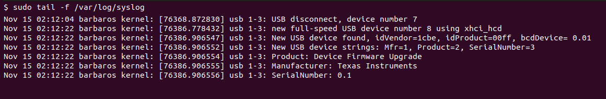

__Updating Your ROSRider's Firmware__

***Important Note:*** Before proceeding with the firmware update, ensure you have the correct firmware file for your specific ROSRider model. Incorrect firmware can lead to device malfunction.

To initiate the firmware update process, follow these steps:

Enter Bootloader Mode:
- Press and Hold the Boot Button: Keep the boot button pressed.
- Press and Release the Reset Button: While still holding the boot button, press and quickly release the reset button.
- Release the Boot Button: Once the reset button is released, you can also release the boot button.

The ROSRider should now enter bootloader mode. This is indicated by the green LED lighting up constantly.

Issue the following command on your console:

```console
sudo tail -f /var/log/syslog
```

You should see an output similar to:

<div style="display: flex; justify-content: space-around; margin: 25px 0;">
   
</div>

Important Considerations:

- Power Supply: Ensure a stable power supply during the update process.
- USB Connection: A reliable USB connection is crucial.
- Firmware Compatibility: Always use the firmware provided by ACADA Robotics for your specific model.
- Patience: The firmware update process may take some time. Avoid interrupting the process.

By following these steps and adhering to the specific instructions provided by ACADA Robotics, you can successfully update your ROSRider's firmware and enhance its capabilities.

__Updating Firmware with dfu-util__

[TODO explain how to install dfu-util]  
[TODO you will need a linx computer]  


__Next Chapter:__ [Troubleshooting](../10_DEBUG/README.md)
