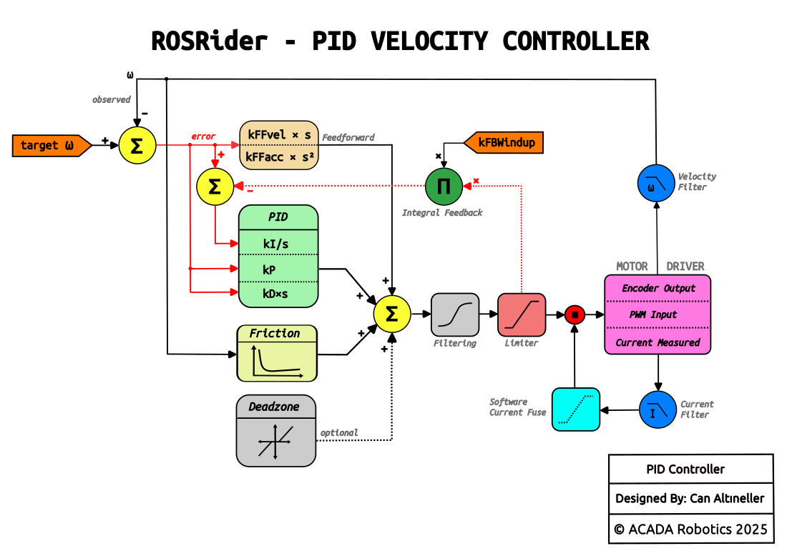
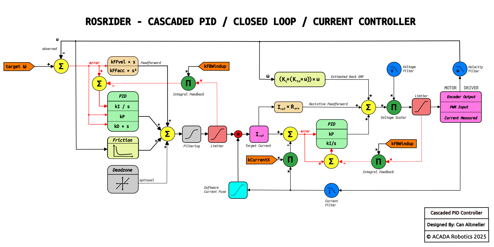

    

        PID Controller
    

The standard control mode uses a single-loop PID architecture augmented with predictive compensation terms.
To improve tracking during dynamic maneuvers, the controller applies **velocity and acceleration feedforwards,**
essentially supplying the energy needed for the motion profile before any error occurs.
We also implemented a **physics-based Stribeck friction model** to counteract mechanical resistance like stiction and viscous drag.
This effectively linearizes the motor response, ensuring the control loop is driving the load rather than just fighting against friction thresholds.  

  <figure style="width: 60%; margin: 0; text-align: center;">
    
    <figcaption>ROSRider PID Loop, Classic Mode</figcaption>
  </figure>

    

        Cascaded Current Controller
    

The cascaded PID controller utilizes a nested loop architecture, where the outer loop calculates the 
desired current reference, and the inner faster loop modulates the motor voltage to strictly regulate torque.

This inner stage employs a **physics-based feedforward strategy**, injecting calculated terms for resistive voltage drop and estimated Back-EMF (BEMF) directly into the control output.
By utilizing DSP-filtered velocity and current data to predict the motor's electrical requirements, the PI controller is relieved of the bulk control effort and focuses solely on disturbance rejection.
This decoupling of electrical dynamics from mechanical load simplifies tuning and ensures the system remains robust and stable even if the robot's weight or inertia changes significantly.

  <figure style="width: 100%; margin: 0; text-align: center;">
    
    <figcaption>ROSRider PID Loop, Cascaded Current Control Mode</figcaption>
  </figure>

__Next Chapter:__ [Procedures](../08_PROCEDURES/README.md)