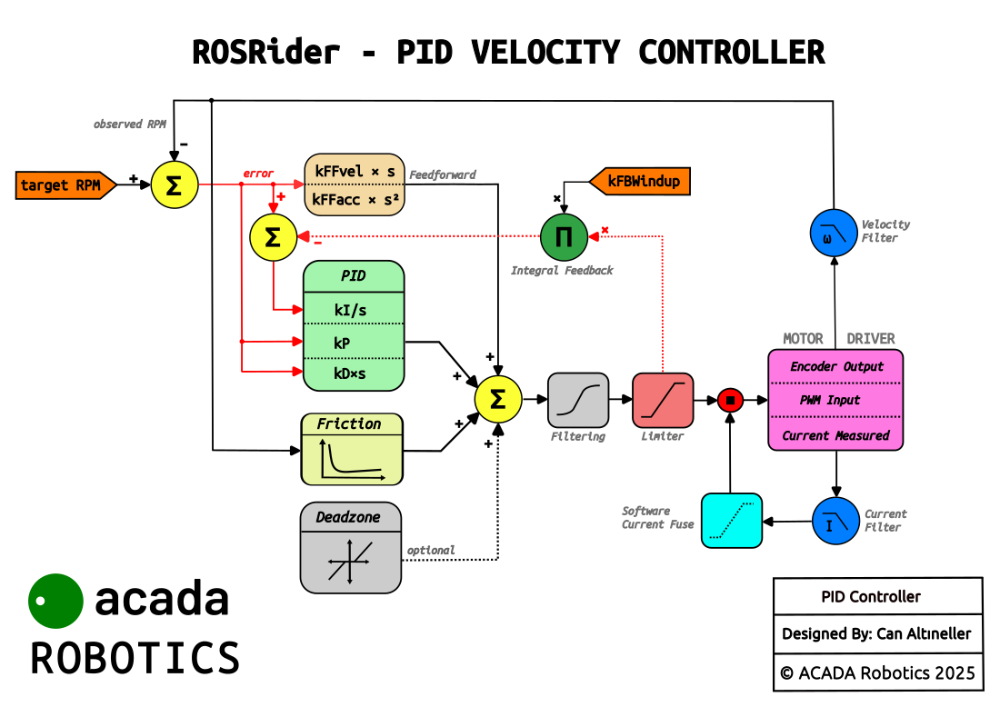

    

        > The Gateway to ROS.
    

    

        "ROSRider auto-synchronizes with your host to ensure low-latency command execution and precise telemetry streaming."
    

  <figure style="width: 60%; margin: 0; text-align: center;">
    
    <figcaption>ROSRider PID Loop, Classic Mode</figcaption>
  </figure>

__Next Chapter:__ [Procedures](../08_PROCEDURES/README.md)