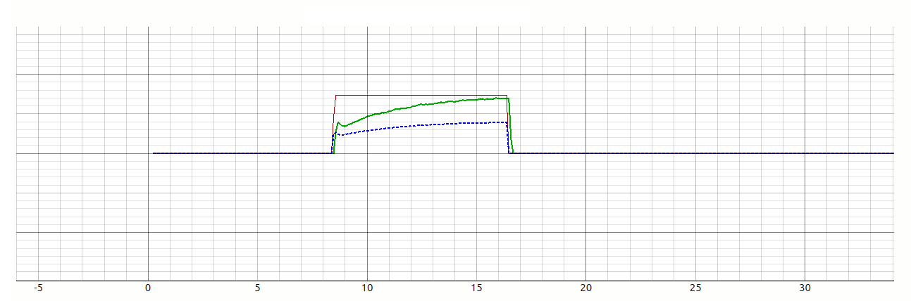

    

        > Physics
    

### Velocity Feedforward

Velocity feedforward prevents the controller from lagging by proactively supplying the voltage necessary
to counteract the motor’s Back Electromotive Force (Back-EMF) at a given speed.
In standard operation, this acts as a direct voltage adder proportional to the target velocity.  

Crucially, in **Cascaded mode**, this feedforward is not ignored but rather architecturally
shifted to the inner loop to improve physical accuracy; because the motor’s generated
Back-EMF naturally "fights back" against the driving current, the inner loop explicitly calculates and 
injects a Back-EMF compensation term (`EB_ff`).  

This ensures that the voltage required to simply maintain speed is supplied immediately, 
allowing the current controller to focus entirely on torque generation rather
than wasting gain trying to overcome the motor's own generated voltage.

  <figure class="img_fg70">
    
    <figcaption>Classic PID, set with default values, struggling to catch the target</figcaption>  
  </figure>

### Acceleration Feedforward

Acceleration feedforward compensates for the system's mechanical inertia by injecting an
immediate control effort whenever a change in velocity is requested,
rather than waiting for a position or velocity error to accumulate.  

In the standard control mode, this is applied as a direct voltage
contribution `ff_acceleration` calculated from the rate of change
in the target speed.  

When the controller operates in Cascaded mode, this logic adapts by converting
the acceleration demand into an equivalent current target `control_effort_amps`; 
using the motor's armature resistance `R_arm`, the system calculates exactly
how much extra current is required to generate the torque needed for that specific acceleration,
adding this directly to the inner loop’s reference target.  

  <figure class="img_fg70">
    
    <figcaption>Cascaded PID, with acceleration feedforward and friction compensation</figcaption>
  </figure>

### Stiction and Friction Injection (SCV)

The friction compensation utilizes a comprehensive physics-based model—combining
`STATIC_KICK`, `COULOMB_RUN`, and `VISCOUS_FRICTION` terms—calculated entirely within
the outer PID loop to ensure the controller preemptively overcomes mechanical resistance. 

This **Smooth Stribeck** approach dynamically calculates the physical voltage required to break stiction,
decaying exponentially from a high `STATIC_KICK` value down to a steady `COULOMB_RUN`
level as speed increases, while simultaneously adding a linear viscous term. 

The application of this static kick is gated by the `SCV_LATCH_THRESHOLD`
when the target velocity falls below this specific threshold,
the aggressive static kick and viscous terms are strictly disabled,
applying only the constant Coulomb Run voltage to prevent low-speed oscillation 
while maintaining sufficient holding force.

### Friction Compensation Voltage vs Angular Velocity

The graph below shows the total added friction volts as a function of angular velocity. `STATIC_KICK = 6V`, `STRIBECK_WIDTH = 16`, `COULOMB_RUN = 3V`, `VISCOUS_FRICTION = 0.001`, `SCV_LATCH_THRESHOLD = 2 rad/s`

  <figure class="img_fg65">
    
  </figure>

### Cascaded Control Architecture

In Cascaded Mode, the controller splits the regulation task into two distinct loops. An outer velocity loop 
and an inner current loop—transforming the primary control output from **Voltage** to **Torque**
The outer loop processes the velocity error and PID terms,
but instead of generating a direct PWM duty cycle, 
it translates the control effort into a precise Current Reference (amps)  

This stage effectively linearizes the mechanical response;
mechanical feedforwards, such as the current required to accelerate the rotor inertia or
break static friction, are calculated here and summed directly into the
amperage target (control_effort_amps)  

This ensures the inner loop receives a **torque command** that already accounts
for the physical forces required to move the load.  

  <figure class="img_fg65">
    
  </figure>

The cascaded PID controller utilizes a nested loop architecture, where the outer loop calculates the 
desired current reference, and the inner faster loop modulates the motor voltage to strictly regulate torque.

This inner stage employs a **physics-based feedforward strategy**, injecting calculated terms for resistive voltage drop and estimated Back-EMF (BEMF) directly into the control output.
By utilizing DSP-filtered velocity and current data to predict the motor's electrical requirements, the PI controller is relieved of the bulk control effort and focuses solely on disturbance rejection.
This decoupling of electrical dynamics from mechanical load simplifies tuning and ensures the system remains robust and stable even if the robot's weight or inertia changes significantly.

### Inner Loop Voltage Composition

The inner loop receives this current target and modulates the motor voltage to achieve it, 
decoupling electrical dynamics from mechanical ones. 

To maximize responsiveness, it constructs the final output voltage using a feedforward-heavy approach: 
it calculates the Resistive Voltage `VR_ff` needed to push the target current through the motor windings 
`V = I_ref * R` and adds the Back-EMF Compensation `EB_ff` to counteract the voltage generated by the spinning motor.  

By proactively supplying the voltage for these known physical properties,
the inner PI controller only needs to correct for  small disturbances and transient errors
between the target and observed current,  resulting in a stiffer and more accurate control response.

__Next Chapter:__ [Controller Diagram](../07_DIAGRAM/README.md)