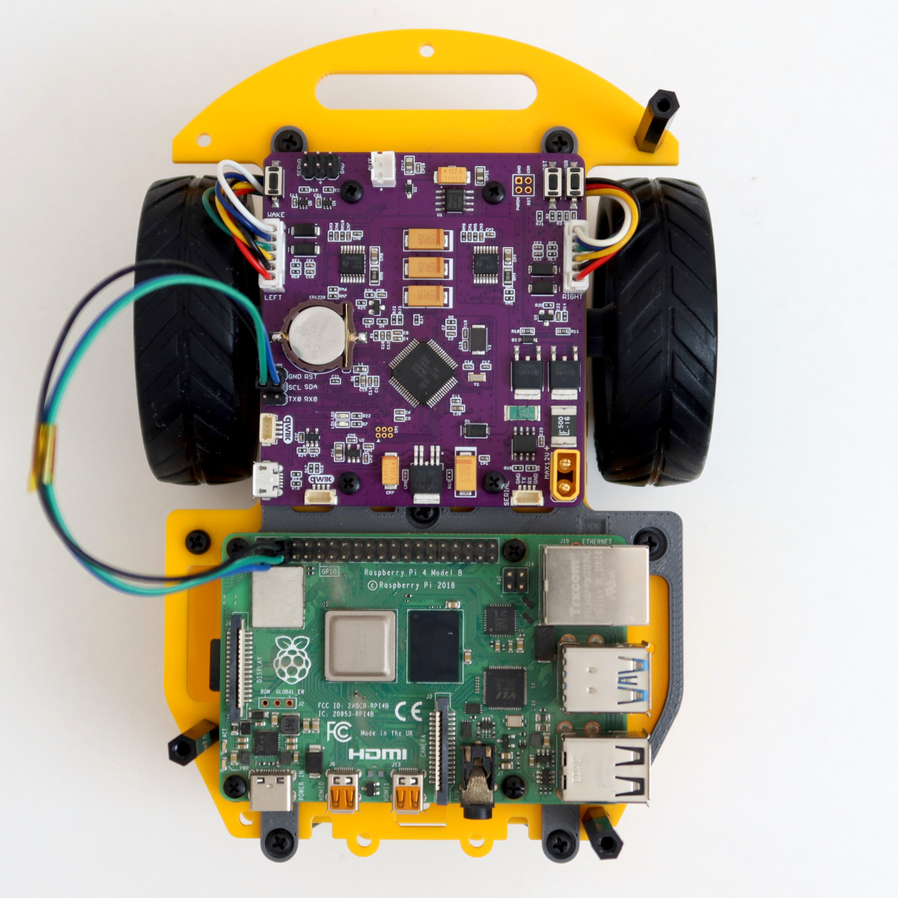

ROSRider is a versatile electronics card that empowers you to create custom ROS-compatible robots. 
It supports a range of small encoder gear motors, enabling the construction of 2-wheeled or 4-wheeled robots of small to medium size.

ROSRider is designed to empower makers and students, to build robots using readily available components. Unlike pre-built kits that can be costly and limiting, ROSRider that can be integrated with existing hardware. This approach encourages creativity, reduces costs, and promotes the reuse of existing components, making robotics accessible to a wider audience.

Below is an image of a minimal chassis designed for lane-following tasks using image processing. This compact setup incorporates two encoder gear motors, a Raspberry Pi 4 computer, and a ROSRider card, all seamlessly integrated into a minimal footprint. This streamlined platform empowers developers to quickly prototype and experiment with autonomous vehicle concepts, making it an ideal tool for learning and innovation in robotics.

  
  <figure style="width: 30%; margin: 0; text-align: center;">
    
    <figcaption style="font-size: 0.85em; margin-top: 10px; font-style: italic; color: #555;">Fig 1. Minimal chassis designed for lane-following tasks using image processing</figcaption>
  </figure>

  <figure style="width: 30%; margin: 0; text-align: center;">
    
    <figcaption style="font-size: 0.85em; margin-top: 10px; font-style: italic; color: #555;">Fig 2. Chassis with LIDAR designed for  SLAM / Navigation</figcaption>
  </figure>

  <figure style="width: 30%; margin: 0; text-align: center;">
    
    <figcaption style="font-size: 0.85em; margin-top: 10px; font-style: italic; color: #555;">Fig 3. ROSRider Control Card</figcaption>
  </figure>

- [Introduction](01_INTRO/README.md)
- [Connections and Pinmaps](02_PINMAP/README.md)
- [Connecting ROSRider to Host Computer](03_CONNECT/README.md)
- [ROS2 Drivers](04_DRIVERS/README.md)
- [Parameters](05_PARAMETERS/README.md)
- [Updating Firmware](06_FIRMWARE/README.md)
- [Procedures in Robotics](08_PROCEDURES/README.md)
- [Simulations](09_SIMULATIONS/README.md)
- [Troubleshooting](10_DEBUG/README.md)

ROSRider aims to lower the cost barrier for building ROS based robots. Using commodity parts, users can build robots that can run the Robot Operating System.

ROSRider has a bootloader system where the user can upgrade firmware over USB, without a specialized programmer.