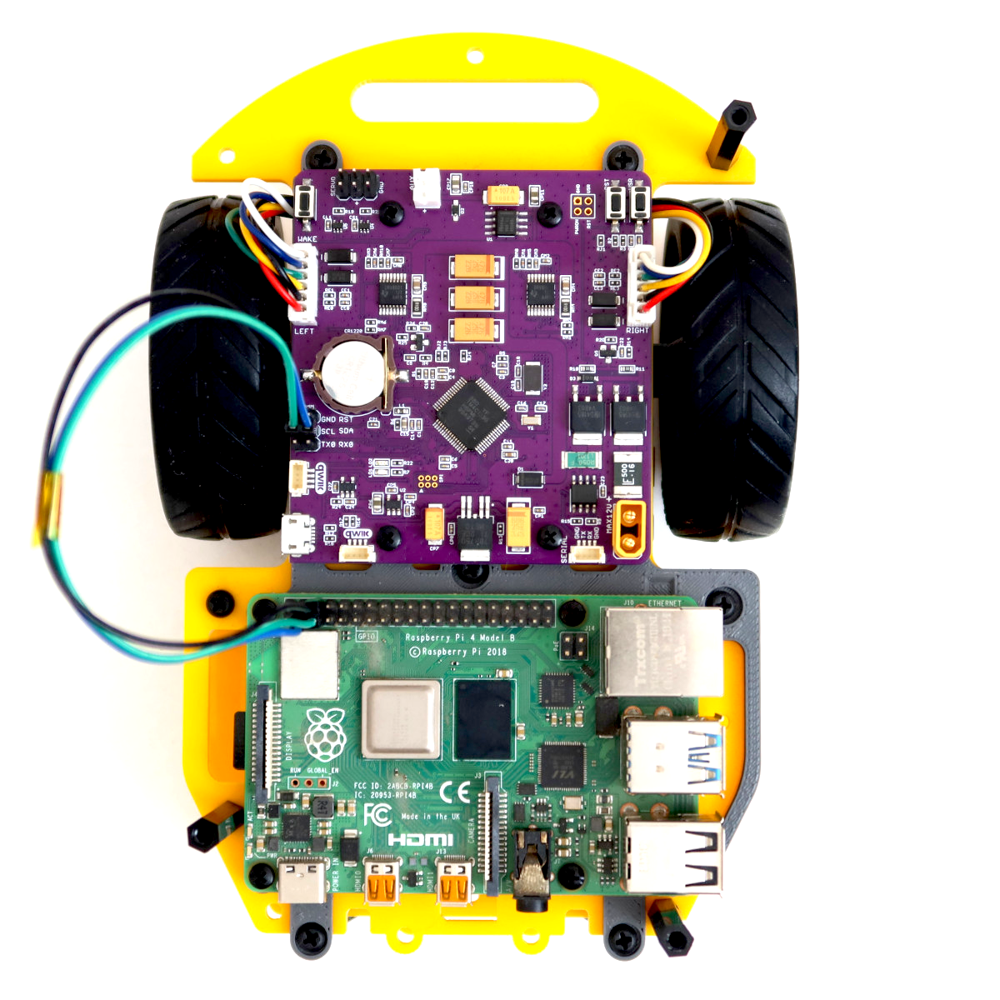
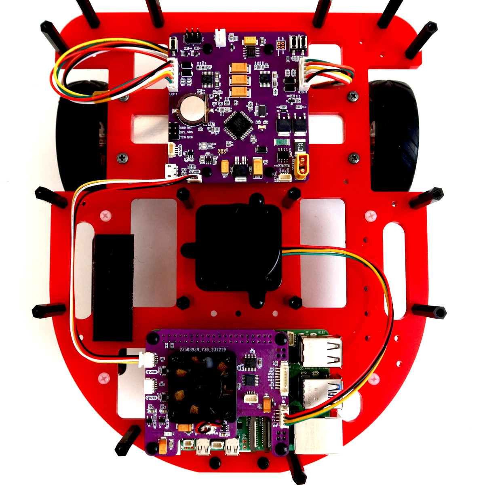
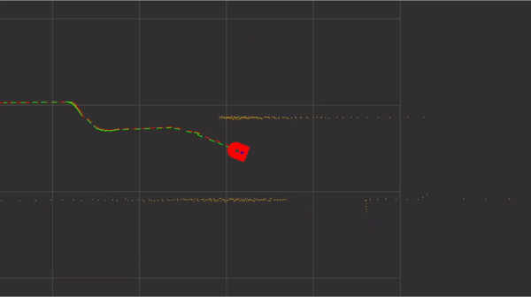
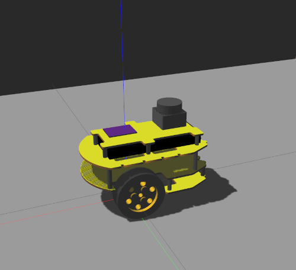
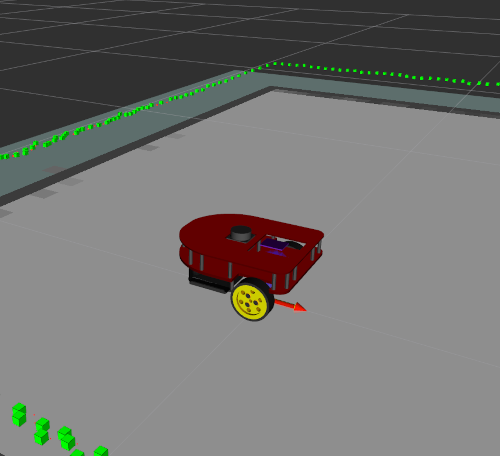
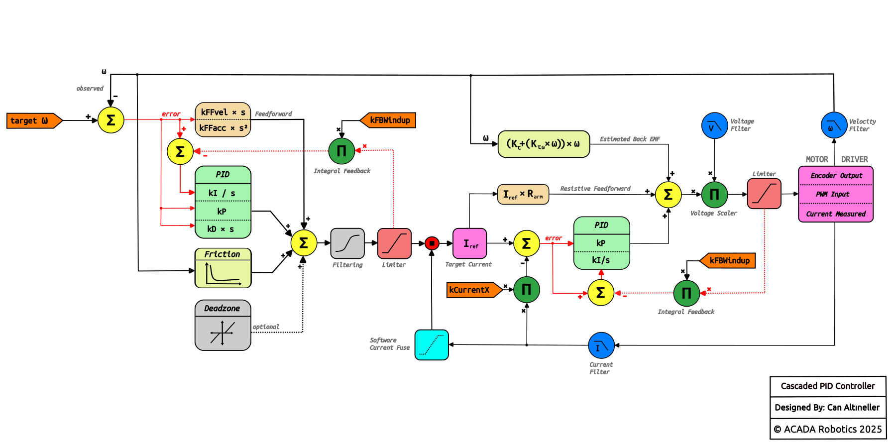
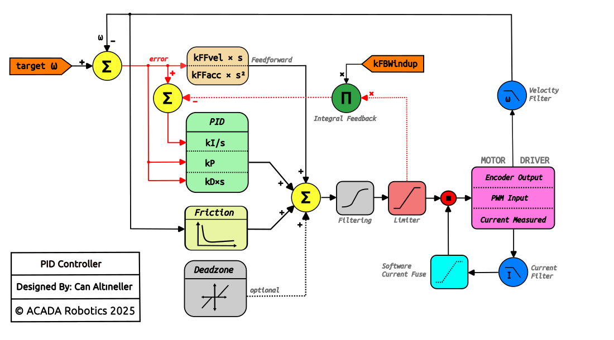
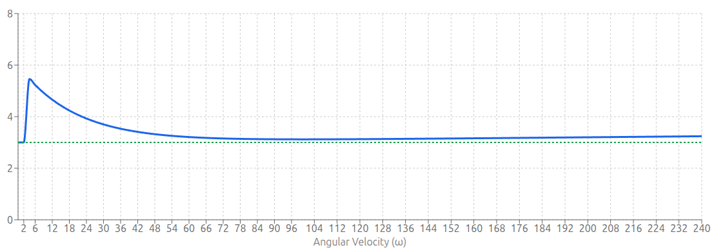

    

        > ROSRider aims to lower the cost barrier for building ROS based robots.
    

    

        "Using commodity parts, users can build robots that can run the Robot Operating System."
    

ROSRider is a versatile electronics card that empowers you to create custom ROS-compatible robots.
It supports a range of small encoder gear motors, enabling the construction of 2-wheeled or 4-wheeled robots of small to medium size.
ROSRider is designed to empower makers and students, to build robots using readily available components.
Unlike pre-built kits that can be costly and limiting, it can be integrated with existing hardware.
This approach encourages creativity, reduces costs, and promotes the reuse of existing components, making robotics accessible to a wider audience.

  <figure class="img_fg25">
    
    <figcaption>Fig 1. Minimal chassis designed for lane-following tasks using image processing</figcaption>
  </figure>
  <figure class="img_fg25">
    
    <figcaption>Fig 2. Chassis with LIDAR designed for  SLAM / Navigation</figcaption>
  </figure>
  <figure class="img_fg25">
    
    <figcaption>Fig 3. ROSRider Control Card</figcaption>
  </figure>

__ROS Enabled Robotics__

The typical minimal setup incorporates two encoder gear motors, a Raspberry Pi computer, and a ROSRider card, all seamlessly integrated into a minimal footprint.
This integrated control card, paired with its comprehensive ROS software package, streamlines development by handling complex low-level tasks. This empowers developers to rapidly prototype and experiment with autonomous vehicle concepts, making it an ideal toolkit for learning and innovation in robotics.

Our products significantly simplify the user experience by automating tasks like battery management and device power cycling.
This eliminates the need for manual intervention, such as disconnecting batteries or manually powering on devices.
The ROS2RPI card offers flexible serial port routing, enabling remote access to the Raspberry Pi and other devices like LiDAR sensors.
This feature prevents boot conflicts caused by LiDAR serial output during system startup and allows for remote control of the LiDAR, extending its operational life and simplifying maintenance procedures.

  <figure class="img_fg50">
    
    <figcaption>Fig 4. Odometry and LIDAR data visualization</figcaption>
  </figure>

__Gazebo Simulation Support__

To further enhance the integration of ROSRider with open-source robotics, we have developed two open-source robot platforms: Sorcerer and Caretta. These low-cost, pre-built robots, accompanied by URDF files for ROS and Gazebo simulation, streamline the development process. Developers can rapidly prototype and test algorithms in simulation before deploying them to physical hardware, significantly accelerating development time and reducing costs associated with physical experimentation.

  
  <figure class="img_fg25">
    
    <figcaption>Fig 5. Gazebo Simulation with CARETTA</figcaption>
  </figure>

  <figure class="img_fg25">
    
    <figcaption>Fig 6. Gazebo Simulation with SORCERER</figcaption>
  </figure>

  <figure class="img_fg25">
    
    <figcaption>Fig 7. RVIZ visualization of Simulated Robot</figcaption>
  </figure>

__Supported Motors__

ROSRider can drive a wide range of encoder gear motors, from simple DC motors to high-precision gear motors commonly found in robotic vacuum cleaners. It supports both single-phase and dual-phase encoders, with parameters such as encoder PPR and gear reduction ratio configurable through YAML files. The dual-channel drivers, delivering 1A continuous and 2.8A peak current, provide ample power for various robotic applications.

  
  <figure class="img_fg25">
    
    <figcaption>Fig 8. Metal Gear Motor</figcaption>
  </figure>

  <figure class="img_fg25">
    
    <figcaption>Fig 9. Plastic Gear Motor (DG01D-E)</figcaption>
  </figure>

  <figure class="img_fg25">
    
    <figcaption>Fig 10. Vacuum Cleaner Spare Part</figcaption>
  </figure>

    

        > Cascaded Control Architecture
    

In Cascaded Mode, the controller splits the regulation task into two distinct loops. An outer velocity loop 
and an inner current loop—transforming the primary control output from **Voltage** to **Torque**
The outer loop processes the velocity error and PID terms,
but instead of generating a direct PWM duty cycle, 
it translates the control effort into a precise Current Reference (amps)  

This stage effectively linearizes the mechanical response;
mechanical feed-forwards, such as the current required to accelerate the rotor inertia or
break static friction, are calculated here and summed directly into the
amperage target (control_effort_amps)  

This ensures the inner loop receives a **torque command** that already accounts
for the physical forces required to move the load.  

  <figure class="img_fg90">
    
  </figure>

The cascaded PID controller utilizes a nested loop architecture, where the outer loop calculates the 
desired current reference, and the inner faster loop modulates the motor voltage to strictly regulate torque.

This inner stage employs a **physics-based feed-forward strategy**, injecting calculated terms for resistive voltage drop and estimated Back-EMF (BEMF) directly into the control output.
By utilizing DSP-filtered velocity and current data to predict the motor's electrical requirements, the PI controller is relieved of the bulk control effort and focuses solely on disturbance rejection.
This decoupling of electrical dynamics from mechanical load simplifies tuning and ensures the system remains robust and stable even if the robot's weight or inertia changes significantly.

### Inner Loop Voltage Composition

The inner loop receives this current target and modulates the motor voltage to achieve it, 
decoupling electrical dynamics from mechanical ones. 

To maximize responsiveness, it constructs the final output voltage using a feed-forward heavy approach: 
it calculates the Resistive Voltage `VR_ff` needed to push the target current through the motor windings 
`V = I_ref * R` and adds the Back-EMF Compensation `EB_ff` to counteract the voltage generated by the spinning motor.  

By proactively supplying the voltage for these known physical properties,
the inner PI controller only needs to correct for  small disturbances and transient errors
between the target and observed current,  resulting in a stiffer and more accurate control response.

    

        > Standard PID Mode
    

The standard control mode uses a single-loop PID architecture augmented with predictive compensation terms.
To improve tracking during dynamic maneuvers, the controller applies **velocity and acceleration feed-forwards,**
essentially supplying the energy needed for the motion profile before any error occurs.
We also implemented a **physics-based Stribeck friction model** to counteract mechanical resistance like stiction and viscous drag.
This effectively linearizes the motor response, ensuring the control loop is driving the load rather than just fighting against friction thresholds.  

  <figure class="img_fg60">
    
  </figure>

    

        > Velocity and Acceleration Feed-Forwards
    

### Velocity Feed-forward

Velocity feed-forward prevents the controller from lagging by proactively supplying the voltage necessary
to counteract the motor’s Back Electromotive Force (Back-EMF) at a given speed.
In standard operation, this acts as a direct voltage adder proportional to the target velocity.  

Crucially, in **Cascaded mode**, this feed-forward is not ignored but rather architecturally
shifted to the inner loop to improve physical accuracy; because the motor’s generated
Back-EMF naturally "fights back" against the driving current, the inner loop explicitly calculates and 
injects a Back-EMF compensation term (`EB_ff`).  

This ensures that the voltage required to simply maintain speed is supplied immediately, 
allowing the current controller to focus entirely on torque generation rather
than wasting gain trying to overcome the motor's own generated voltage.

### Acceleration Feed-forward

Acceleration feed-forward compensates for the system's mechanical inertia by injecting an
immediate control effort whenever a change in velocity is requested,
rather than waiting for a position or velocity error to accumulate.  

In the standard control mode, this is applied as a direct voltage
contribution `ff_acceleration` calculated from the rate of change
in the target speed.  

When the controller operates in Cascaded mode, this logic adapts by converting
the acceleration demand into an equivalent current target `control_effort_amps`; 
using the motor's armature resistance `R_ARM`, the system calculates exactly
how much extra current is required to generate the torque needed for that specific acceleration,
adding this directly to the inner loop’s reference target.

    

        > Stiction and Friction Injection (SCV)
    

The friction compensation utilizes a comprehensive physics-based model—combining
`STATIC_KICK`, `COULOMB_RUN`, and `VISCOUS_FRICTION` terms—calculated entirely within
the outer PID loop to ensure the controller preemptively overcomes mechanical resistance. 

This **Smooth Stribeck** approach dynamically calculates the physical voltage required to break stiction,
decaying exponentially from a high `STATIC_KICK` value down to a steady `COULOMB_RUN`
level as speed increases, while simultaneously adding a linear viscous term. 

The application of this static kick is gated by the `SCV_LATCH_THRESHOLD`
when the target velocity falls below this specific threshold,
the aggressive static kick and viscous terms are strictly disabled,
applying only the constant Coulomb Run voltage to prevent low-speed oscillation 
while maintaining sufficient holding force.

#### Friction Compensation Voltage vs Angular Velocity

The graph below shows the total added friction volts as a function of angular velocity. `STATIC_KICK = 6V`, `STRIBECK_WIDTH = 16`, `COULOMB_RUN = 3V`, `VISCOUS_FRICTION = 0.001`, `SCV_LATCH_THRESHOLD = 2 rad/s`

  <figure class="img_fg75">
    
  </figure>

__Next Chapter:__ [ROS Drivers](04_DRIVERS/README.md)