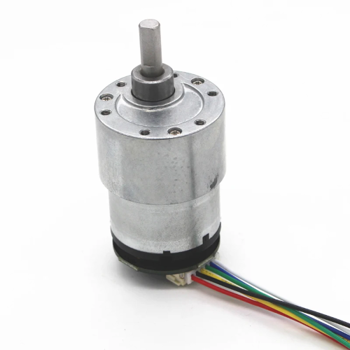
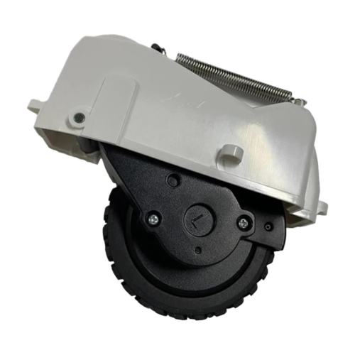

ROSRider is a versatile electronics card that empowers you to create custom ROS-compatible robots.
It supports a range of small encoder gear motors, enabling the construction of 2-wheeled or 4-wheeled robots of small to medium size.
ROSRider is designed to empower makers and students, to build robots using readily available components.
Unlike pre-built kits that can be costly and limiting, it can be integrated with existing hardware.
This approach encourages creativity, reduces costs, and promotes the reuse of existing components, making robotics accessible to a wider audience.

  
  <figure style="width: 25%; margin: 0; text-align: center;">
    
    <figcaption style="font-size: 0.85em; margin-top: 10px; font-style: italic; color: #666;">Fig 1. Minimal chassis designed for lane-following tasks using image processing</figcaption>
  </figure>

  <figure style="width: 25%; margin: 0; text-align: center;">
    
    <figcaption style="font-size: 0.85em; margin-top: 10px; font-style: italic; color: #666;">Fig 2. Chassis with LIDAR designed for  SLAM / Navigation</figcaption>
  </figure>

  <figure style="width: 25%; margin: 0; text-align: center;">
    
    <figcaption style="font-size: 0.85em; margin-top: 10px; font-style: italic; color: #666;">Fig 3. ROSRider Control Card</figcaption>
  </figure>

The typical minimal setup incorporates two encoder gear motors, a Raspberry Pi computer, and a ROSRider card, all seamlessly integrated into a minimal footprint.
This integrated control card, paired with its comprehensive ROS software package, streamlines development by handling complex low-level tasks. This empowers developers to rapidly prototype and experiment with autonomous vehicle concepts, making it an ideal toolkit for learning and innovation in robotics.

Our products significantly simplify the user experience by automating tasks like battery management and device power cycling.
This eliminates the need for manual intervention, such as disconnecting batteries or manually powering on devices.
The ROS2RPI card offers flexible serial port routing, enabling remote access to the Raspberry Pi and other devices like LiDAR sensors.
This feature prevents boot conflicts caused by LiDAR serial output during system startup and allows for remote control of the LiDAR, extending its operational life and simplifying maintenance procedures.

  <figure style="width: 50%; margin: 0; text-align: center;">
    
    <figcaption style="font-size: 0.85em; margin-top: 10px; font-style: italic; color: #666;">Fig 4. Odometry and LIDAR data visualization</figcaption>
  </figure>

To further enhance the integration of ROSRider with open-source robotics, we have developed two open-source robot platforms: Sorcerer and Caretta. These low-cost, pre-built robots, accompanied by URDF files for ROS and Gazebo simulation, streamline the development process. Developers can rapidly prototype and test algorithms in simulation before deploying them to physical hardware, significantly accelerating development time and reducing costs associated with physical experimentation.

  
  <figure style="width: 25%; margin: 0; text-align: center;">
    
    <figcaption style="font-size: 0.85em; margin-top: 10px; font-style: italic; color: #666;">Fig 1. Minimal chassis designed for lane-following tasks using image processing</figcaption>
  </figure>

  <figure style="width: 25%; margin: 0; text-align: center;">
    
    <figcaption style="font-size: 0.85em; margin-top: 10px; font-style: italic; color: #666;">Fig 2. Chassis with LIDAR designed for  SLAM / Navigation</figcaption>
  </figure>

  <figure style="width: 25%; margin: 0; text-align: center;">
    
    <figcaption style="font-size: 0.85em; margin-top: 10px; font-style: italic; color: #666;">Fig 3. ROSRider Control Card</figcaption>
  </figure>

__Supported Motors__

ROSRider can drive a wide range of encoder gear motors, from simple DC motors to high-precision gear motors commonly found in robotic vacuum cleaners. It supports both single-phase and dual-phase encoders, with parameters such as encoder PPR and gear reduction ratio configurable through YAML files. The dual-channel drivers, delivering 1A continuous and 2.8A peak current, provide ample power for various robotic applications. Additionally, users can fine-tune motor performance by adjusting parameters like forward and backward deadzones, PWM frequency (up to 18kHz for reduced noise), and motor driver configurations (brake mode, low-side and high-side decay).

  
  
  

__Future-Proof Design__

To ensure long-term usability and adaptability, the ROSRider card supports firmware updates via USB. This allows for continuous improvement and the addition of new features, without requiring specialized programming tools or hardware modifications.

To further expand its compatibility, we are exploring the possibility of a USB firmware version based on user demand.

It includes an SPI port for potential integration of additional sensors and actuators as technology advances and user needs evolve.

- [Introduction](01_INTRO/README.md)
- [Connections and Pinmaps](02_PINMAP/README.md)
- [Connecting ROSRider to Host Computer](03_CONNECT/README.md)
- [ROS2 Drivers](04_DRIVERS/README.md)
- [Parameters](05_PARAMETERS/README.md)
- [Updating Firmware](06_FIRMWARE/README.md)
- [Procedures in Robotics](08_PROCEDURES/README.md)
- [Simulations](09_SIMULATIONS/README.md)
- [Troubleshooting](10_DEBUG/README.md)

ROSRider aims to lower the cost barrier for building ROS based robots. Using commodity parts, users can build robots that can run the Robot Operating System.

ROSRider has a bootloader system where the user can upgrade firmware over USB, without a specialized programmer.